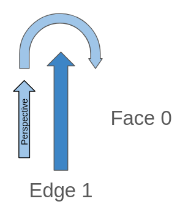
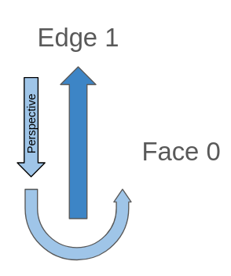

# 32. 토폴로지 기본 타입 (Topology Basic Types)

> 공식 원문: [<https://postgis.net/workshops/postgis-intro/topology_base_types.html>](https://postgis.net/workshops/postgis-intro/topology_base_types.html)\
> 공식 소스의 본문·표·SQL·이미지를 현재 페이지 순서대로 반영했습니다.

이 문서를 읽기 전에 다음 리소스 중 하나 이상을 검토하십시오.

[입문 워크숍: PostGIS 토폴로지 워크숍](31_topology.md).

[설명서: PostGIS 토폴로지](https://postgis.net/docs/Topology.html).

[ISO 토폴로지: OGC-SFS 기하학](https://www.gaia-gis.it/fossil/libspatialite/wiki?name=topo-intro).

이번 워크숍에서는 토폴로지의 기본 원리와 기본 및 정의를 살펴보겠습니다. 직접 사용하는 방법은 아니며, 이해하고 쉽게 사용할 수 있도록 하는 것입니다.

## 종류

기본 토폴로지는 세 가지 기본 유형에서 작동합니다.

- 노드: 2D 포인트, 모든 것이 여기에서 시작되거나 끝납니다.
- 가장자리: 노드에서 시작하고 끝나는 방향이 있는 유도선
- 면: 다각형을 따르는 닫힌 라인스트링 세트

노드, 모서리 및 면 집합이 유효해야 하는 몇 가지 규칙이 있습니다. ISO 토폴로지 문서를 확인하세요. 이러한 조건에 대한 매우 좋은 요약이 있으며, 모든 규칙을 따르는 토폴로지는 유효한 토폴로지입니다.

알아두면 좋은 점은 지금까지 Postgis는 이 모든 정보를 내부적으로 저장하고 각 유형에는 고유한 ID가 있으며 이를 사용하여 사용 가능한 기능을 사용하여 이를 편집하고 변경할 수 있다는 것입니다. 예를 들어 ST_RemEdgeNewFace를 사용하면 가장자리를 제거하고 새 면을 만들 수 있습니다.

하지만 여전히 누락된 부분이 있습니다. 예를 들어 얼굴에 특정 속성이 있다고 어떻게 말합니까? Postgis는 이를 수행하기 위해 레이어, TopoGeometry, TopoElement와 같은 여러 개념을 구현합니다.

## 유니버설 페이스

가장자리로 구성된 면만 존재한다고 생각하는 것이 직관적일 수 있습니다. 한 가지 예외가 있는데, 모든 면 중 공백도 모두 얼굴입니다!

빈 공간을 Universal Face라고 하며, Topology가 비어 있으면 모든 공간이 Universal Face가 되고, 라인스트링을 추가하면 이 면의 가장자리가 되며, 폴리곤을 만들면 면에 구멍을 뚫고 이를 훔쳐서 면에 할당하는 것과 같습니다.

이 면은 무한하며 어떤 경계도 없습니다.

Universal Face의 ID는 0입니다.

## 가장자리 해석

토폴로지와 해당 형식을 올바르게 표현하기 위해 모든 것을 저장하는 테이블을 구성하는 데 사용되는 몇 가지 정의가 있으며 가장자리는 더 복잡한 테이블에 있습니다.

엣지에 대한 모든 정보는 사용자 정의 토폴로지 스키마의 edge_data 테이블에 저장됩니다. 엣지에는 어떤 정보가 필요합니까? 기본적으로 노드와 면 정보, 엣지는 이 둘을 연결하는 원시적 요소입니다.

이러한 라인스트링은 면의 가장자리이기 때문에 가장자리라고 합니다.

### 가장자리 방향, 왼쪽 및 오른쪽

토폴로지의 에지에는 올바르게 정의된 관점과 보기가 있으며, 이를 볼 때 다음 방법으로 수행되어야 합니다.

가장자리 관점에서 보려는 경우 항상 끝 노드에서 시작 가장자리까지이며 항상 가장자리를 앞쪽으로 봅니다.

가장자리에는 왼쪽 및 오른쪽 속성이 있습니다. 가장자리 관점을 사용하여 정의된 것처럼 시작 노드에서 끝 노드까지 라인스트링을 보면 항상 왼쪽과 오른쪽이 잘 정의되어 있습니다.

따라서 앞쪽의 가장자리를 보면 항상 왼쪽과 오른쪽이 있습니다.

이는 가장자리의 각 측면에 있는 면을 연관시키는 데 도움이 됩니다.

이미지의 모서리를 확인하면 거의 모든 모서리가 아래에서 위로, 왼쪽에서 오른쪽으로 이동하는 반면 반대 방향을 갖는 주황색 모서리가 있으므로 다른 모서리를 기준으로 왼쪽과 오른쪽이 서로 바뀌지만 모서리를 앞쪽으로 보면 오른쪽과 왼쪽이 오른쪽입니다.

계속해서 주황색 가장자리를 확인하세요. 오른쪽에는 가장자리로 구성된 다각형이 있고 왼쪽에는 Universal Face가 있습니다.

어떤 에지를 분석하고 에지 관점에서 보아야 할 때, 항상 에지를 앞쪽으로 바라보고 결코 뒤쪽을 바라보지 않습니다!

다음 모서리는 모두 어느 것입니까? 우리는 시작 노드에서 끝 노드로 이동하며, 가장자리의 끝 노드에서 시작하거나 끝나는 모든 가장자리를 기대합니다!

## 엣지 데이터

edge_data 테이블에는 엣지와 관련된 정보가 있으며, 지금 우리가 알고 있는 것에서 다음 열을 해석할 수 있습니다.

- edge_id: 엣지의 고유 ID
- start_node : Edge의 시작점과 동일한 노드의 ID
- end_node: 엣지의 끝점과 동일한 노드의 ID
- left_face: 가장자리 왼쪽에 있는 면의 ID
- right_face: 모서리 오른쪽 면의 ID
- geom : 엣지의 기하학

### 절대 다음 가장자리 및 다음 가장자리

edge_data 테이블에는 abs_next_left_edge 및 abs_next_right_edge 열이 있는데, 현재 이를 해석하는 방법이 약간 까다로워집니다.

지금까지 우리는 주로 가장자리 자체의 속성과 측면에 있는 속성을 확인했습니다. 다음 가장자리 속성은 다릅니다. 가장자리 자체에 대해서만 묻지 않고 오른쪽 또는 왼쪽에 면을 만드는 다음 가장자리가 무엇인지에 대해 묻습니다.

right_edge와 left_edge의 논리는 매우 유사하므로 먼저 왼쪽을 더 자세히 살펴본 다음 오른쪽을 표시합니다.

다음 토폴로지를 예로 사용하겠습니다.

#### 왼쪽

예를 들어 Edge 5를 선택해 보겠습니다. 이것은 Left the Face 2에 있습니다. Face 2를 구성하는 다음 가장자리는 무엇일까요?

엣지6 입니다.

여기서 매우 중요한 점은 가장자리 방향에 따라 선을 따라가는 관점이 시계 방향이나 시계 반대 방향으로 면을 보는 것과 같다는 것입니다.

이 정보를 사용하면 abs_next_left_edge가 6이 됩니다.

next_left_edge는 우리가 가장자리를 보는 관점에 따라 음수가 될 수 있다는 점을 제외하면 abs_next_left_edge와 거의 동일합니다.

가장자리 관점을 따르면 다음 가장자리의 방향과 다음 가장자리의 관점 방향이라는 두 가지 방향이 있습니다.

각 경우에 다음 기호를 사용합니다.

- 투시 방향과 다음 가장자리 방향이 반대입니다: "-"
- 원근 방향과 다음 가장자리 방향이 동일합니다. 없음, 양수 값을 유지합니다.

Perspective와 Edge 6의 방향이 같으므로 next_left_edge는 6이 됩니다.

- abs_next_left_edge : 6
- next_left_edge : 6

#### 맞아요

왼쪽 분석과 오른쪽 분석의 유일한 차이점은 관점입니다. 반면 왼쪽에서는 앞으로를 사용하고 오른쪽에서는 뒤로 봅니다. 조심하세요, 뒤를 돌아봐도 왼쪽 얼굴과 오른쪽 얼굴의 정의는 여전히 똑같습니다. 따라야 할 관점만 변경합니다.

Edge 5의 오른쪽에는 Face 0이 있고 Universal Face가 있습니다. Edge 5를 거꾸로 보면 Face 0을 만드는 다음 Edge가 Edge 4입니다.

Edge 4의 Edge 5의 원근을 따라가면 위로 올라가고 Edge 4는 아래로 내려가며 Perspective 방향과 Edge 4 방향이 반대되는 것을 볼 수 있습니다.

- abs_next_right_edge : 4
- next_right_edge: -4 (원근 방향과 Edge 4 방향이 반대)

#### 격리된 엣지 케이스

헷갈릴 수 있는 경우가 있는데, 위의 모든 규칙은 모두 동일하게 따르지만 한 번 살펴보는 것이 좋습니다.

다른 가장자리와 연결되지 않은 가장자리가 있는 경우 가장 먼저 인식할 수 있는 것은 왼쪽 면이 오른쪽 면과 동일하다는 것입니다. 이 경우에는 면 0, 즉 보편적인 면입니다.

과거 논리를 따른다면 왼쪽에는 Face 0이 있고, Face 0을 만드는 다음 가장자리는 무엇일까요? 실제로 Edge가 있고 그 자체이며 이전과 같은 관점도 있습니다.

원근 방향을 확인하면 동일한 가장자리를 반대 방향으로 보는 것으로 끝납니다. 이는 가장자리 1과 다음 가장자리(가장자리 1)의 방향이 반대임을 의미합니다.

- edge_id: 1 -abs_next_left_edge: 1
- next_left_edge: -1 (고립된 가장자리를 앞으로 보는 동안 이는 항상 음수입니다)

다음 오른쪽 가장자리는 동일하고 다음 가장자리는 그 자체가 되며 변경되는 유일한 것은 관점입니다.

고립된 가장자리를 거꾸로 보면 관점은 항상 가장자리와 동일한 방향을 갖습니다.

- edge_id: 1 -abs_next_right_edge: 1
- next_right_edge: -1 (우리가 고립된 가장자리를 역방향으로 보는 동안 이것은 항상 양수입니다)

### edge_data의 전체 열

우리는 이미 edge_data 테이블의 모든 열을 확인했습니다.

- edge_id: 엣지의 고유 ID입니다.
- start_node: Edge의 시작점과 동일한 노드의 ID입니다.
- end_node: Edge의 끝점과 동일한 노드의 ID입니다.
- left_face: 가장자리 왼쪽에 있는 면의 ID입니다.
- abs_next_left_edge: 왼쪽에 면을 만드는 다음 가장자리입니다.
- next_left_edge: abs_next_left_edge 및 오른쪽 면이 다음 왼쪽 가장자리의 오른쪽에 있는 경우 음수 부호.
- right_face: 가장자리 오른쪽에 있는 면의 ID입니다.
- abs_next_right_edge: 오른쪽 면을 만드는 다음 에지입니다.
- next_right_edge: abs_next_right_edge 및 왼쪽 면이 다음 오른쪽 가장자리의 오른쪽에 있는 경우 음수 부호.
- geom: 모서리의 형상입니다.

---

[← 이전](31_topology.md) · [목차](00_index.md) · [다음 →](33_topology_topo_types.md)
