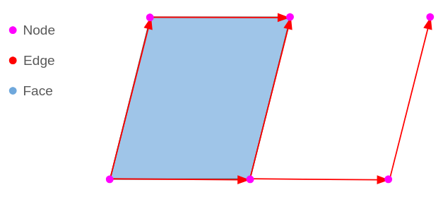
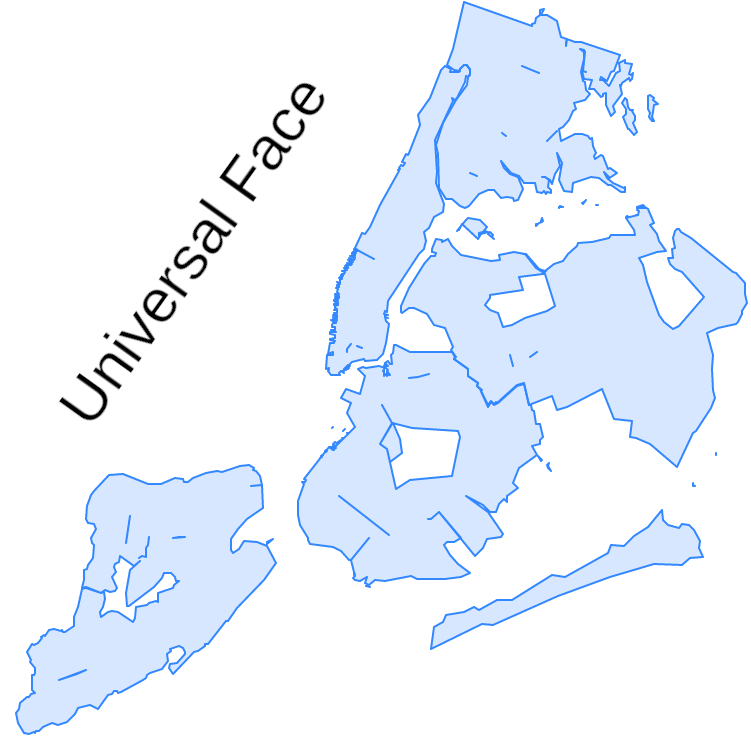
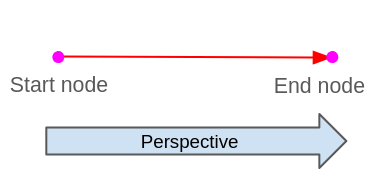
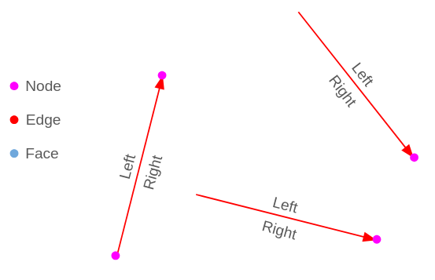
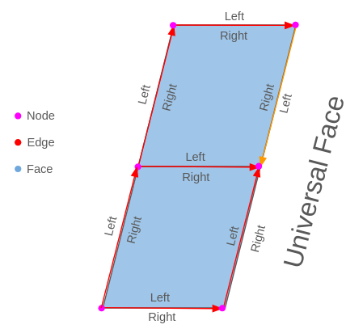
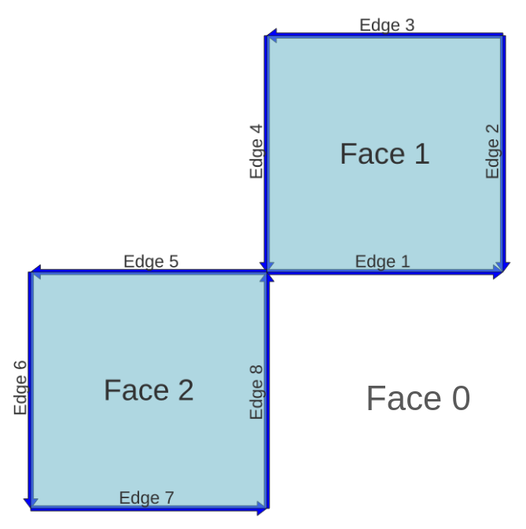
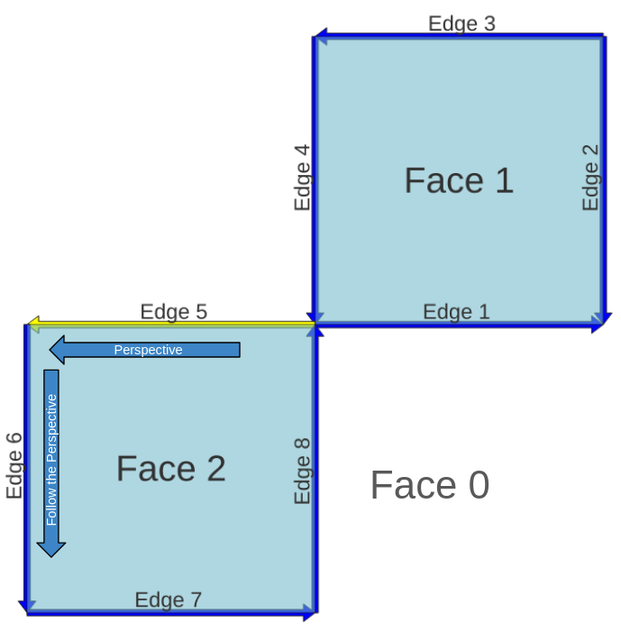
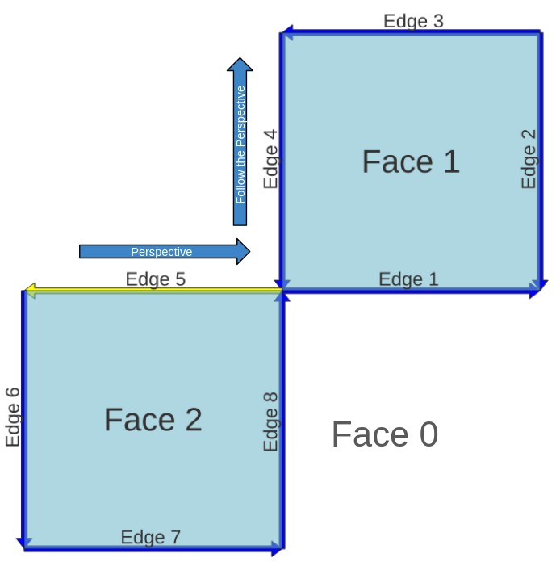
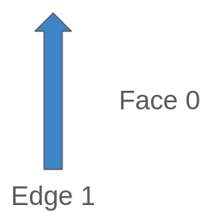

# 32. 토폴로지 기본 타입 (Topology Basic Types)

> 공식 원문: [<https://postgis.net/workshops/postgis-intro/topology_base_types.html>](https://postgis.net/workshops/postgis-intro/topology_base_types.html)\
> 공식 소스의 본문·표·SQL·이미지를 현재 페이지 순서대로 반영했습니다.

토폴로지 데이터 모델의 내부 동작 원리를 이해하려면 이를 구성하는 3대 기본 위상 원시 요소(Primitives)와 에지(Edge)의 방향성 해석 메커니즘을 알아야 합니다.

---

## 1. 토폴로지의 3대 기본 위상 원시 요소 (Primitives)

1. **노드 (Node / 정점)**: 2차원 공간상의 점(Point)입니다. 모든 에지는 노드에서 시작하여 노드에서 끝납니다.
2. **에지 (Edge / 간선)**: 시작 노드(`start_node`)에서 끝 노드(`end_node`)로 연결되는 방향성을 가진 선분(LineString)입니다.
3. **페이스 (Face / 면)**: 에지들의 폐곡선 링으로 둘러싸인 2차원 다각형 영역(Polygon)입니다.

---

## 2. 유니버설 페이스 (Universal Face / ID: 0)

토폴로지 공간에서 아무런 다각형도 생성되지 않은 빈 배경 공간 역시 하나의 거대한 페이스로 취급됩니다. 이를 **유니버설 페이스(Universal Face)**라고 부르며, 고유 **ID 번호는 항상 `0`**입니다.

새로운 다각형을 생성하면 유니버설 페이스(0번 면)로부터 일부 영역을 분할하여 새로운 번호의 내부 페이스(Face 1, Face 2 등)를 할당하는 개념입니다.

---

## 3. 에지의 관점과 좌우 페이스 (Edge Perspective)

토폴로지 내의 모든 에지는 방향성을 갖습니다. 에지를 바라보는 표준 관점은 항상 **시작 노드에서 끝 노드를 향해 앞을 바라보는 방향**입니다.

이 진행 방향을 기준으로 에지의 좌측과 우측이 명확히 정의됩니다.

- **`left_face`**: 에지의 진행 방향 기준 왼쪽에 위치한 페이스 ID
- **`right_face`**: 에지의 진행 방향 기준 오른쪽에 위치한 페이스 ID

위 그림에서 주황색 에지처럼 진행 방향이 아래로 향하는 경우, 우측에는 내부 폴리곤(Face)이 위치하고 좌측에는 유니버설 페이스(Face 0)가 위치하게 됩니다.

---

## 4. edge_data 테이블의 구조 및 다음 에지(Next Edge) 해석

토폴로지 스키마 내의 `edge_data` 테이블에는 에지의 위상 연결 정보가 저장됩니다.

### edge_data 컬럼 상세 정의
- **`edge_id`**: 에지의 고유 식별자 (정수)
- **`start_node`**: 에지의 시작점 노드 ID
- **`end_node`**: 에지의 끝점 노드 ID
- **`left_face`**: 에지 진행 방향 기준 좌측 페이스 ID
- **`right_face`**: 에지 진행 방향 기준 우측 페이스 ID
- **`abs_next_left_edge`**: 좌측 페이스(left_face)의 경계를 반시계 방향으로 이어 나가는 다음 에지의 절대 번호
- **`next_left_edge`**: 다음 에지의 원래 진행 방향이 순회 관점과 같으면 양수, 반대 방향이면 **음수(`-`)** 부호가 붙은 번호
- **`abs_next_right_edge`**: 우측 페이스(right_face)의 경계를 이어 나가는 다음 에지의 절대 번호
- **`next_right_edge`**: 다음 에지의 진행 방향 일치 여부에 따른 부호화 번호
- **`geom`**: 에지의 실제 라인스트링 지오메트리

---

### 좌측 다음 에지 해석 예시 (Left Face)
에지 5(Edge 5)를 기준으로 살펴보겠습니다.

- Edge 5의 좌측에는 Face 2가 있습니다.
- Face 2의 둘레를 따라 진행할 때 Edge 5의 끝점에서 이어지는 다음 에지는 **Edge 6**입니다.
- Edge 6의 자체 방향(위쪽)이 순회 방향과 동일하므로 부호는 양수입니다.
  - `abs_next_left_edge`: `6`
  - `next_left_edge`: `6`

---

### 우측 다음 에지 해석 예시 (Right Face)

- Edge 5의 우측에는 Face 0(유니버설 페이스)이 있습니다.
- Face 0의 둘레를 따라 진행할 때 이어지는 다음 에지는 **Edge 4**입니다.
- Edge 4의 자체 방향은 아래를 향하고 있어 순회 관점과 정반대 방향입니다.
  - `abs_next_right_edge`: `4`
  - `next_right_edge`: **`-4`** (반대 방향)

---

### 고립된 에지 (Isolated Edge) 케이스
다른 어떤 에지와도 연결되지 않은 단독 선분이 유니버설 페이스(Face 0) 안에 떠 있는 경우:

- `left_face`와 `right_face` 모두 `0` (유니버설 페이스)
- 에지의 끝점에 도달하면 다시 자기 자신을 거슬러 돌아오게 되므로 다음 에지는 자기 자신이 됩니다.
  - 좌측 순회: `next_left_edge` = `-1`
  - 우측 순회: `next_right_edge` = `1`

---

[← 이전](31_topology.md) · [목차](00_index.md) · [다음 →](33_topology_topo_types.md)
