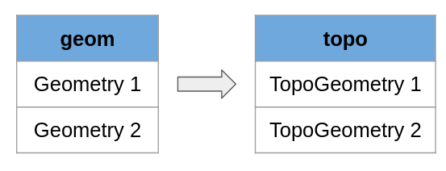
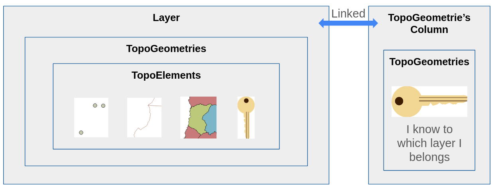
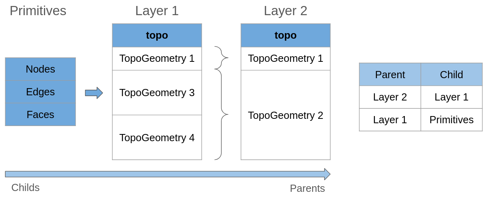
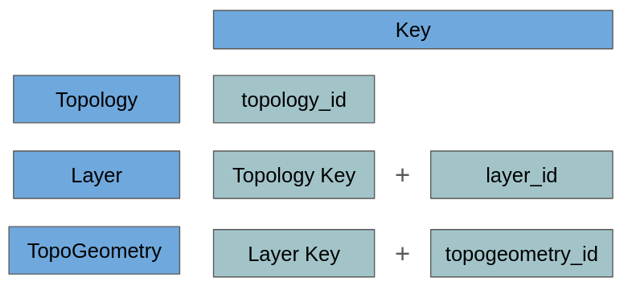
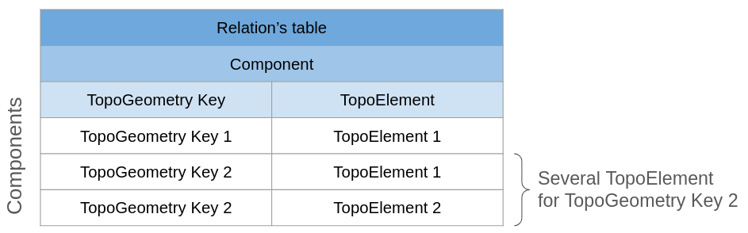
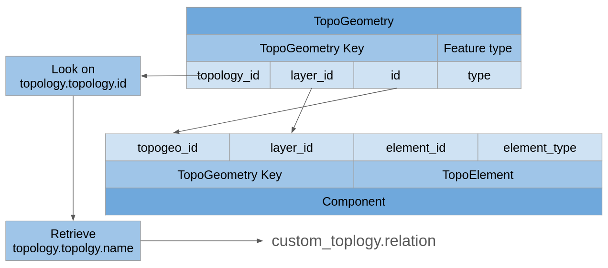
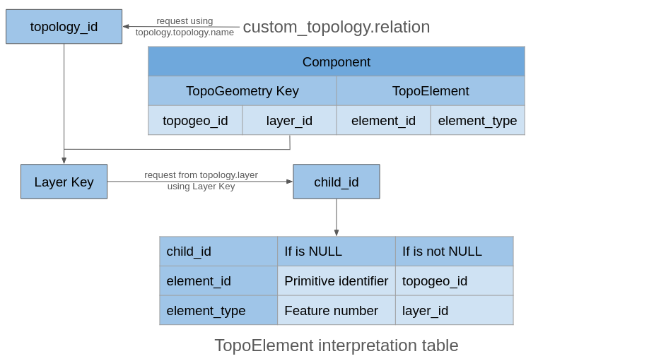

# 33. 토폴로지와 지오메트리 표현 (Topology and Geometry Representation)

> 공식 원문: [<https://postgis.net/workshops/postgis-intro/topology_topo_types.html>](https://postgis.net/workshops/postgis-intro/topology_topo_types.html)\
> 공식 소스의 본문·표·SQL·이미지를 현재 페이지 순서대로 반영했습니다.

이 문서를 읽기 전에 다음 리소스 중 하나 이상을 검토하십시오.

- [토폴로지 기본 유형](https://postgis.net/workshops/en/postgis-intro/topology_base_types.html)
- [입문 워크숍: PostGIS 토폴로지 워크숍](https://postgis.net/workshops/en/postgis-intro/topology.html)

모든 기본 요소가 포함된 토폴로지를 갖는 것이 유용하지만 더 실용적으로 만들기 위해서는 이러한 요소를 테이블에 표시하는 방법이 필요합니다. 공간 테이블이 있는 것과 유사하게 토폴로지 테이블이 있을 수 있습니다.

## 기하학 표현 소개

기하학을 표현하기 위해 토폴로지를 사용하는 예를 따라왔다면 이것을 기억할 것입니다. 기하학 테이블에서 토폴로지 테이블을 채울 때 기하학 대신 TopoGeometries를 사용하고 어떤 방식으로든 각 TopoGeometry는 토폴로지에 포함된 하나 또는 여러 개의 프리미티브를 나타낼 수 있습니다.



요점은 TopoGeometry에서 실제 프리미티브에 도달하는 방법, 데이터가 구조화되는 방법이므로 먼저 가장 전역적인 정의를 살펴보겠습니다.



TopoGeometry는 기본 요소 또는 기타 TopoGeometry 그룹을 나타낼 수 있습니다. TopoGeometry를 생성하려면 레이어가 필요합니다.

레이어는 가장 큰 상자이며, TopoElements도 저장하는 TopoGeometries를 저장합니다. 이 마지막 레이어는 프리미티브 또는 기타 TopoGeometries를 나타냅니다.

그냥 두 가지 방법으로 작성하면 됩니다.

- 레이어에는 TopoGeometries가 포함되어 있으며 각 TopoGeometry에는 동일한 TopoElement 유형의 TopoElement가 포함되어 있습니다.
- 각 TopoElement는 다음을 나타낼 수 있습니다.
  - 다른 레이어의 TopoGeometry
  - 기하학 컬렉션
  - 토폴로지의 기본: 노드, 모서리 또는 면

TopoGeometries는 키로 노출되며 레이어 내부에 고유한 키가 있을 뿐만 아니라 해당 레이어 키도 저장합니다. 이를 통해 Postgis는 이를 임의의 열에 저장하고 항상 TopoElement와 해당 항목이 나타내는 것을 찾을 수 있습니다.

TopoGeometry가 구성될 레이어가 필요하며, 그 후에는 해당 레이어가 속한 레이어를 기억할 필요가 없습니다.

이 개념은 사용자를 위해 사용되는 개념으로, 여기서부터 심도 있고 기술적인 세부 사항을 설명하겠습니다.

참고로, Postgis 토폴로지는 내부적으로 키에 관한 몇 가지 트릭을 가지고 있으며 많은 부분을 최적화하는 데 도움이 되지만 동시에 중복된 정보도 많이 있습니다. 두 개 이상의 위치에서 동일한 정보를 발견하더라도 놀라지 마십시오.

## 기능

TopoElements는 TopoGeometry 및 프리미티브를 나타낼 수 있습니다. TopoGeometry를 생각해 보세요. TopoElement에 저장하면 여전히 다른 TopoElement가 포함되어 있으며 해당 경로를 따르면 항상 토폴로지의 프리미티브로 끝납니다.

기능은 형상 세트의 유형을 나타내며 TopoGeometries 또는 기본 요소를 사용하는 경우 중요하지 않습니다. 결국 레이어는 다음 세트를 직접 또는 간접적으로 포함할 수 있습니다.

- 1)  노드
- 2)  가장자리
- 3)  얼굴
- 4)  기하학 컬렉션

숫자는 중요합니다. 기능 유형을 요청하는 모든 기능에서는 숫자나 이름을 문자열로 사용하여 지정할 수 있습니다.

## 계층적 레이어, 하위 및 상위

이 개념은 나중에 소개하고 싶지만 개념을 더 잘 설명하고 더 깊이 설명하려면 이것이 필요합니다.



이미지의 첫 번째 측면은 프리미티브를 사용하여 구성된 테이블입니다. 레이어 1에는 TopoElement가 토폴로지의 프리미티브만 참조하는 TopoGeometries가 있습니다.

레이어 1과 프리미티브 간의 관계를 다음과 같이 정의합니다.

- 레이어 1은 프리미티브의 상위입니다.
- 프리미티브는 레이어 1의 하위 항목입니다.

부모와 자식 사이의 관계는 크기에 관한 것입니다. 자식은 작습니다. 그룹이 있으면 더 큰 그룹인 부모를 구성합니다.

레이어 2는 레이어 1의 하위 항목으로, 이는 이 레이어의 각 TopoGeometry를 의미하며 레이어 1의 하나 또는 여러 TopoGeometry를 참조할 수 있음을 의미합니다.

이는 또한 레이어 1에서 TopoGeometry의 절반을 선택할 수 없다는 것을 의미합니다. 절반을 선택한다는 것은 TopoGeometry의 TopoElement 중 하나에 대한 참조가 필요하다는 것을 의미합니다. 이 경우 이 프리미티브(자식)에 속하며, 실제로 필요한 경우 레이어 1 하위(프리미티브)를 사용하여 레이어 2를 구축합니다.

각 레이어에는 하나의 하위 레이어만 있을 수 있습니다. 즉, 하위 레이어와 상위 레이어는 동일한 토폴로지 스키마를 공유합니다.

Hierarchy의 일부 측면은 TopoGeometry 절반 또는 레이어 혼합과 같은 기능을 지원하도록 변경될 수 있지만 현재는 구현되지 않습니다.

## 레이어

TopoGeometries를 저장하려면 레이어가 필요합니다. 왜냐하면 TopoGeometrie의 열을 생성할 때 레이어도 생성하기 때문입니다. 이것이 바로 이에 대한 열을 생성하기 위해 특수 함수를 사용하는 이유입니다.

[크레타 TopoGeometry 기둥](https://postgis.net/docs/AddTopoGeometryColumn.html)

레이어와 TopoGeometry 열은 특별한 관계를 가지고 있으며 연결되어 있지만 동일하지는 않습니다.

레이어에는 우리가 원하는 레이어 유형을 알기 위해 제공해야 하는 많은 정보가 있습니다.

레이어에는 각 토폴로지의 고유 식별자가 있으며 이 식별자를 layer_id라고 합니다.

- 레이어 키: \[topology_id, layer_id\]로 구성된 키
- 테이블 경로: 스키마 이름, 테이블 이름, 컬럼 이름이 어디에 연결되어 있는지 알 수 있습니다.
- 피처 유형: 레이어에 포함될 피처 유형입니다.
- 레벨: 이 값은 0에서 시작합니다. 다른 레이어를 사용하여 이 레이어를 구성하는 경우 1이 추가되므로 프리미티브에서 레이어 수를 알 수 있습니다. 값이 0이면 레이어가 TopoGeometries 대신 프리미티브를 사용하여 구성되었음을 의미합니다.
- child_id: 기본 레이어를 사용하지 않고 다른 레이어를 기본으로 사용하여 레이어를 구축한 경우 이 레이어의 레이어 식별자(layer_id)가 필요하지만 이미 상위 레이어에서 알고 있으므로 topology_id가 필요하지 않습니다.

## 관계 테이블

마지막으로, Postgis 토폴로지가 TopoGeometry에서 포함된 내용으로 어떻게 이동하는지 살펴보는 섹션입니다.

관계의 테이블 기능은 상위와 하위 사이의 다리 역할을 합니다.

이 테이블은 `my_topology.relation`에서 찾을 수 있습니다.

### 우리가 지금 알고 있는 키와 식별자

특정 상황에서는 "식별자"라는 단어를 고유 키로 사용하겠습니다. 예를 들어 각 레이어에는 식별자(layer_id)로 숫자가 있으며 이는 토폴로지 컨텍스트에서 고유하지만 데이터베이스에서 레이어를 찾기에는 충분하지 않습니다.

식별자는 컨텍스트에서 작동하지만 키는 요소를 처리하는 완전한 방법입니다. 예를 들어 모든 레이어의 키는 \[topology_id, layer_id\] 두 값입니다.



이미지는 각각의 키가 어떻게 구성되어 있는지를 잘 요약한 것입니다.

#### 키의 암시적 식별자

Postgis는 레이어 및 TopoGeometries로 작업할 때 어느 정도 암시적 논리를 사용합니다. 이는 이를 알기 위해 전체 키를 저장할 필요가 없는 컨텍스트가 있기 때문입니다.

예를 표시하려면 다음을 수행하세요.

TopoGeometry는 다음으로 구성됩니다.

- topology_id
- 레이어_ID
- Topogeometry_id

이전에 말했듯이 관계의 테이블은 토폴로지 스키마 내에 저장됩니다. 이 테이블에는 TopoGeometry와 TopoElements의 관계가 포함됩니다. 이 컨텍스트에서 참조를 만들려면 topology_id가 필요합니까?

건너뛸 수 있어요! 토폴로지 스키마 밖에 있는 동안 이를 찾으려면 ID가 필요하지만 내부에 있는 동안에는 스키마 이름을 보고 모든 토폴로지 ID와 이름이 있는 `topology.topology` 테이블에서 해당 ID를 찾을 수 있습니다.

### TopoGeometry

TopoGeometry는 다음 요소를 포함하는 복합 키입니다.

- topology_id: TopoGeometry 키의 topology_id
- layer_id : TopoGeometry Key의 layer_id
- id: TopoGeometry 키의 topogeometry_id
- 유형: 기능 유형을 숫자로 표시

### Basic Relation의 테이블 구조

각 스키마 토폴로지는 자체 관계 테이블을 가질 수 있으며, 이는 첫 번째 TopoGeometry를 생성할 때 생성되며, 테이블은 토폴로지 내부에 `custom_topology.relation`로 저장됩니다.

테이블의 각 행은 관계의 구성 요소처럼 "구성 요소"라고 합니다.

구성 요소는 TopoGeometry 키와 TopoElement라는 두 가지 항목의 쌍을 저장합니다. 각 TopoElement는 하나의 기본 또는 TopoGeometry만 나타낼 수 있으므로 TopoGeometry가 여러 항목을 나타낼 수 있도록 테이블은 동일한 TopoGeometry 키와 다른 TopoElement를 사용하여 여러 행을 저장합니다. 이 방법으로 테이블에서 필터링만 하면 모든 TopoGeometry에 대한 모든 TopoElement를 얻을 수 있습니다.



### TopoGeometry의 구성요소 찾기

TopoGeometry에 속하는 구성 요소를 찾는 것은 약간 까다롭습니다. 여기서는 암시적 키가 작동하기 때문입니다.

구성 요소에는 다음 요소가 있습니다.

- TopoGeometry 키
  - topogeom_id: TopoGeometry Key의 topogeometry_id
  - layer_id: TopoGeometry Key의 layer_id
- 토포엘리먼트
  - 요소_ID
  - 요소_유형

TopoGeometry 키가 불완전하다는 것을 알 수 있습니다. 이는 관계의 테이블이 이미 토폴로지에 속해 있으므로 토폴로지 식별자를 다시 저장할 필요가 없기 때문입니다.

TopoGeometry에서 구성 요소로 이동하려면 TopoGeometry.topology_id를 보고 `topology.topology.id`를 검색하여 토폴로지 이름을 검색해야 합니다. 이를 통해 해당 스키마에서 관계 테이블을 찾을 수 있습니다.



### TopoElement 읽기

TopoGeometry를 분해하는 마지막 부분은 저장된 레이어에 따라 의미가 바뀔 수 있기 때문에 다른 키보다 더 복잡한 TopoElement를 해석할 수 있다는 것입니다.

우리가 말했듯이 레이어는 하위 항목으로 Primitives 또는 TopoGeometries라는 두 가지 옵션을 가질 수 있습니다.

가장 먼저 알아야 할 것은 어떤 하위 항목을 사용하고 있는지입니다. 이를 위해 `TopoGeometry Key.layer_id`를 사용하여 `topology.layer.id`를 살펴보고 `` `topology.layer.child_id ``\`를 가져와야 합니다.

따라서 사례는 child_id에 따라 다릅니다.

- NULL인 경우:
  - element_id: 기본 식별자
  - element_type: 기능 번호, 어떤 기본 테이블도 참조하는지 알아보려면 기능을 살펴보세요.
- NULL이 아닌 경우:
  - element_id: TopoGeometry 키의 topogeometry_id
  - element_type: TopoGeometry 키의 layer_id

첫 번째 경우는 간단합니다. 해당 기본 테이블을 보고 식별자를 사용하여 어떤 기본 형식인지 알아보세요.

두 번째 경우 TopoElement가 새 TopoGeometry 키를 생성하는 데 사용되는 반면, topology_id는 우리가 말한 대로 암시적이므로 키가 완성됩니다. 새 요소를 찾으려면 관계 테이블에서 다시 살펴보되 새 키를 사용하세요.



------------------------------------------------------------------------

<details markdown="1">
<summary><strong>기존 로컬 문서 보존본</strong> — 로컬 실습 확장·요약 내용</summary>

# 33. 토폴로지와 지오메트리 표현 (Topology and Geometry Representation)

토폴로지 모델에 저장된 노드, 에지, 면은 표준 `geometry` 객체로 언제든지 상호 변환할 수 있습니다.

---

## 1. TopoGeometry 데이터 타입

`TopoGeometry`는 일반 테이블의 컬럼으로 정의되며, 토폴로지 스키마 내의 에지나 페이스들의 집합을 가리키는 포인터 역할을 합니다.

```sql
-- 토폴로지 컬럼 추가
SELECT AddTopoGeometryColumn(
  'nyc_topo', 'public', 'my_parcels', 'topogeom', 'POLYGON'
);
```

---

## 2. TopoGeometry를 일반 Geometry로 변환

- `topogeom::geometry`: TopoGeometry 객체를 표준 OGC Geometry로 즉시 캐스팅 변환
- `ST_GetFaceGeometry('topo_name', face_id)`: 특정 Face ID에 해당하는 폴리곤 지오메트리 생성

---

| [⬅️ 32. 토폴로지 기본 타입 (Topology Basic Types)](32_topology_base_types.md) | [🏠 워크숍 목차](README.md) | [34. 트리거를 활용한 변경 이력 추적 (Tracking Edit History using Triggers) ➡️](34_history_tracking.md) |
| :--- | :---: | ---: |

</details>

---

[← 이전](32_topology_base_types.md) · [목차](00_index.md) · [다음 →](34_history_tracking.md)