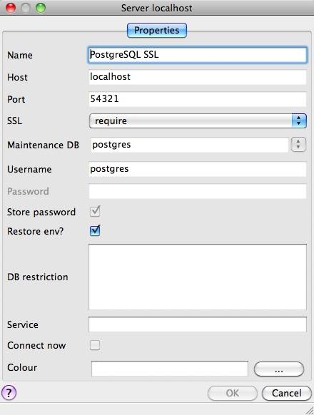
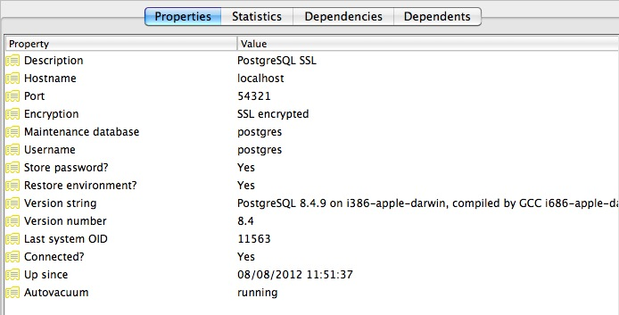

# 36. PostgreSQL 보안 (PostgreSQL Security)

> 공식 원문: [<https://postgis.net/workshops/postgis-intro/security.html>](https://postgis.net/workshops/postgis-intro/security.html)\
> 공식 소스의 본문·표·SQL·이미지를 현재 페이지 순서대로 반영했습니다.

PostgreSQL은 특정 권한을 특정 [역할](http://www.postgresql.org/docs/current/static/user-manag.html)로 분류하고 사용자에게 하나 이상의 [역할](http://www.postgresql.org/docs/current/static/user-manag.html) 권한을 제공하는 기능을 갖춘 풍부하고 유연한 권한 시스템을 갖추고 있습니다.

또한 PostgreSQL 서버는 여러 다른 시스템을 사용하여 사용자를 인증할 수 있습니다. 이는 데이터베이스가 다른 아키텍처 구성요소와 동일한 인증 인프라를 사용하여 비밀번호 관리를 단순화할 수 있음을 의미합니다.

## 사용자 및 역할

이 장에서는 두 명의 유용한 프로덕션 사용자를 만듭니다.

- 게시 애플리케이션에서 사용하기 위한 읽기 전용 사용자입니다.
- 개발자가 소프트웨어를 구축하거나 데이터를 분석하는 데 사용하는 읽기/쓰기 사용자입니다.

사용자를 생성하고 필요한 권한을 부여하는 대신 올바른 권한을 가진 두 개의 역할을 생성한 다음 두 명의 사용자를 생성하여 적절한 역할에 추가합니다. 이렇게 하면 추가 사용자를 생성할 때 역할을 쉽게 재사용할 수 있습니다.

### 역할 만들기

역할은 사용자이고 사용자는 역할입니다. 유일한 차이점은 "사용자"는 "로그인" 권한을 가진 역할이라고 할 수 있다는 것입니다.

따라서 기능적으로 아래 두 SQL 문은 동일합니다. 둘 다 "로그인 권한이 있는 역할", 즉 "사용자"를 생성합니다.

```sql
CREATE ROLE mrbean LOGIN;
CREATE USER mrbean;
```

### 읽기 전용 사용자

읽기 전용 사용자는 웹 애플리케이션이 `nyc_streets` 테이블을 쿼리하는 데 사용됩니다.

응용프로그램은 `nyc_streets` 테이블에 대한 특정 액세스 권한을 가지지만 `postgis_reader` 역할에서 PostGIS 작업에 필요한 시스템 액세스 권한을 상속합니다.

```sql
-- A user account for the web app
CREATE USER app1;
-- Web app needs access to specific data tables
GRANT SELECT ON nyc_streets TO app1;

-- A generic role for access to PostGIS functionality
CREATE ROLE postgis_reader INHERIT;
-- Give that role to the web app
GRANT postgis_reader TO app1;
```

이제 app1로 로그인하면 `nyc_streets` 테이블에서 행을 선택할 수 있습니다. 그러나 `ST_Transform` 호출을 실행할 수 없습니다! 왜 안 돼?

```sql
-- This works!
SELECT * FROM nyc_streets LIMIT 1;

-- This doesn't work!
SELECT ST_AsText(ST_Transform(geom, 4326))
  FROM nyc_streets LIMIT 1;
```

    ERROR:  permission denied for relation spatial_ref_sys
    CONTEXT:  SQL statement "SELECT proj4text FROM spatial_ref_sys WHERE srid = 4326 LIMIT 1"

대답은 오류 설명에 포함되어 있습니다. `app1` 사용자는 `nyc_streets` 테이블의 내용을 잘 볼 수 있지만 `spatial_ref_sys`의 내용은 볼 수 없으므로 `ST_Transform`에 대한 호출이 실패합니다.

따라서 `postgis_reader` 역할에 모든 PostGIS 메타데이터 테이블에 대한 읽기 액세스 권한도 부여해야 합니다.

```sql
GRANT SELECT ON geometry_columns TO postgis_reader;
GRANT SELECT ON geography_columns TO postgis_reader;
GRANT SELECT ON spatial_ref_sys TO postgis_reader;
```

이제 PostGIS 테이블에서 읽어야 하는 모든 사용자에게 적용할 수 있는 멋진 일반 `postgis_reader` 역할이 생겼습니다.

```sql
-- This works now!
SELECT ST_AsText(ST_Transform(geom, 4326))
  FROM nyc_streets LIMIT 1;
```

### 사용자 읽기/쓰기

고려해야 할 두 가지 종류의 읽기/쓰기 시나리오가 있습니다.

- 기존 데이터 테이블에 써야 하는 웹 애플리케이션 및 기타 애플리케이션.
- 작업의 일부로 새 테이블과 도형 열을 생성해야 하는 개발자 또는 분석가.

데이터 테이블에 대한 쓰기 액세스가 필요한 웹 애플리케이션의 경우 테이블 자체에 추가 권한을 부여하기만 하면 `postgis_reader` 역할을 계속 사용할 수 있습니다.

```sql
-- Add insert/update/delete abilities to our web application
GRANT INSERT,UPDATE,DELETE ON nyc_streets TO app1;
```

예를 들어 읽기/쓰기 WFS 서비스에는 이러한 종류의 권한이 필요합니다.

개발자와 분석가의 경우 기본 PostGIS 메타데이터 테이블에 대한 액세스가 조금 더 필요합니다. PostGIS 메타데이터 테이블을 편집할 수 있는 `postgis_writer` 역할이 필요합니다!

```sql
-- Make a postgis writer role
CREATE ROLE postgis_writer;

-- Start by giving it the postgis_reader powers
GRANT postgis_reader TO postgis_writer;

-- Add insert/update/delete powers for the PostGIS tables
GRANT INSERT,UPDATE,DELETE ON spatial_ref_sys TO postgis_writer;

-- Make app1 a PostGIS writer to see if it works!
GRANT postgis_writer TO app1;
```

이제 app1 사용자로 위의 테이블 생성 SQL을 시도하고 어떻게 진행되는지 확인하세요!

## 암호화

PostgreSQL은 많은 [암호화 기능](http://www.postgresql.org/docs/current/static/encryption-options.html)을 제공하며 그 중 다수는 선택 사항이고 일부는 기본적으로 제공됩니다.

- 기본적으로 모든 비밀번호는 MD5로 암호화되어 있습니다. 클라이언트/서버 핸드셰이크는 MD5 비밀번호를 이중으로 암호화하여 비밀번호를 가로채는 사람이 해시를 재사용하는 것을 방지합니다.
- 모든 데이터 및 로그인 정보를 암호화하기 위해 클라이언트와 서버 간에 [SSL 연결](http://www.postgresql.org/docs/current/static/libpq-ssl.html)을 선택적으로 사용할 수 있습니다. SSL 연결을 사용하는 경우에도 SSL 인증서 인증을 사용할 수 있습니다.
- 데이터베이스 내부 열은 해싱 알고리즘, 직접 암호(복어, aes), 공개 키 및 대칭 PGP 암호화를 모두 포함하는 [pgcrypto](http://www.postgresql.org/docs/current/static/pgcrypto.html) 모듈을 사용하여 암호화할 수 있습니다.

### SSL 연결

SSL 연결을 사용하려면 클라이언트와 서버 모두 SSL을 지원해야 합니다.

- SSL을 활성화하려면 다시 시작해야 하므로 먼저 PostgreSQL을 끄십시오.

- 다음으로 SSL 인증서와 키를 획득하거나 생성합니다. 인증서에는 암호가 없어야 합니다. 그렇지 않으면 데이터베이스 서버를 시작할 수 없습니다. 다음과 같이 자체 서명된 키를 생성할 수 있습니다.

      # Create a new certificate, filling out the certification info as prompted
      openssl req -new -text -out server.req

      # Strip the passphrase from the certificate
      openssl rsa -in privkey.pem -out server.key

      # Convert the certificate into a self-signed cert
      openssl req -x509 -in server.req -text -key server.key -out server.crt

      # Set the permission of the key to private read/write
      chmod og-rwx server.key

- `server.crt` 및 `server.key`를 PostgreSQL 데이터 디렉터리에 복사합니다.

- "ssl" 매개변수를 "on"으로 설정하여 `postgresql.conf` 파일에서 SSL 지원을 활성화합니다.

- 이제 PostgreSQL을 다시 시작하세요. 서버가 SSL 작업을 수행할 준비가 되었습니다.

SSL이 활성화된 서버를 사용하면 암호화된 연결을 생성하는 것이 쉽습니다. PgAdmin에서 새 서버 연결을 생성하고(파일 \> 서버 추가...) SSL 매개변수를 "require"로 설정합니다.



새 연결로 연결하면 속성에서 SSL 연결을 사용하고 있음을 확인할 수 있습니다.



기본 SSL 연결 모드는 "선호"이므로 연결 시 SSL 기본 설정을 지정할 필요조차 없습니다. `psql` 터미널 명령줄을 사용하여 연결하면 SSL 옵션이 선택되어 기본적으로 사용됩니다.

    psql (8.4.9)
    SSL connection (cipher: DHE-RSA-AES256-SHA, bits: 256)
    Type "help" for help.

    postgres=#

터미널이 연결의 SSL 상태를 어떻게 보고하는지 확인하세요.

### 데이터 암호화

[pgcrypto](http://www.postgresql.org/docs/current/static/pgcrypto.html) 모듈에는 광범위한 암호화 옵션이 있으므로 가장 간단한 사용 사례인 대칭 암호를 사용하여 데이터 열을 암호화하는 방법만 보여 드리겠습니다.

- 먼저 PgAdmin 또는 psql에서 contrib SQL 파일을 로드하여 pgcrypto를 활성화합니다.

      pgsql/8.4/share/postgresql/contrib/pgcrypto.sql

- 그런 다음 암호화 기능을 테스트해 보세요.

  ```sql
  -- encrypt a string using blowfish (bf)
  SELECT encrypt('this is a test phrase', 'mykey', 'bf');
  ```

- 그리고 뒤집을 수도 있는지 확인하세요!

  ```sql
  -- round-trip a string using blowfish (bf)
  SELECT decrypt(encrypt('this is a test phrase', 'mykey', 'bf'), 'mykey', 'bf');
  ```

## 인증

PostgreSQL은 다양한 [인증 방법](http://www.postgresql.org/docs/current/static/auth-methods.html)을 지원하여 기존 엔터프라이즈 아키텍처에 쉽게 통합할 수 있습니다. 생산 목적으로 다음 방법이 일반적으로 사용됩니다.

- **Password**는 MD5 암호화를 사용하여 데이터베이스에 비밀번호가 저장되는 기본 시스템입니다.
- [Kerberos](http://en.wikipedia.org/wiki/Kerberos_(protocol))는 PostgreSQL의 [GSSAPI](http://en.wikipedia.org/wiki/Generic_Security_Services_Application_Program_Interface) 및 [SSPI](http://msdn.microsoft.com/en-us/library/windows/desktop/aa380493(v=vs.85).aspx) 체계 모두에서 사용되는 표준 기업 인증 방법입니다. [SSPI](http://msdn.microsoft.com/en-us/library/windows/desktop/aa380493(v=vs.85).aspx)를 사용하여 PostgreSQL은 Windows 서버에 대해 인증할 수 있습니다.
- [LDAP](http://en.wikipedia.org/wiki/Lightweight_Directory_Access_Protocol)는 또 다른 일반적인 기업 인증 방법입니다. 대부분의 Linux 배포판과 함께 번들로 제공되는 [OpenLDAP](http://www.openldap.org/) 서버는 [LDAP](http://en.wikipedia.org/wiki/Lightweight_Directory_Access_Protocol)의 오픈 소스 구현을 제공합니다.
- **Certificate** 인증은 모든 클라이언트 연결이 SSL을 통해 이루어질 것으로 예상하고 키 배포를 관리할 수 있는 경우 옵션입니다.
- [PAM](http://en.wikipedia.org/wiki/Pluggable_authentication_module) 인증은 Linux 또는 Solaris를 사용하고 투명한 인증 제공을 위해 [PAM](http://en.wikipedia.org/wiki/Pluggable_authentication_module) 구성표를 사용하는 경우 옵션입니다.

인증 방법은 `pg_hba.conf` 파일에 의해 제어됩니다. 파일 이름의 "HBA"는 "호스트 기반 액세스"를 의미합니다. 각 데이터베이스에 사용할 인증 방법을 지정할 수 있을 뿐만 아니라 네트워크 주소를 사용하여 호스트 액세스를 제한할 수 있기 때문입니다.

다음은 `pg_hba.conf` 파일의 예입니다.

    # TYPE  DATABASE    USER        CIDR-ADDRESS          METHOD

    # "local" is for Unix domain socket connections only
    local   all         all                               trust
    # IPv4 local connections:
    host    all         all         127.0.0.1/32          trust
    # IPv6 local connections:
    host    all         all         ::1/128               trust
    # remote connections for nyc database only
    host    nyc         all         192.168.1.0/2         ldap

파일은 5개의 열로 구성됩니다.

- **TYPE**는 동일한 서버로부터의 연결을 위한 "로컬" 또는 원격 연결을 위한 "호스트" 등 액세스 종류를 결정합니다.
- **DATABASE**는 구성 라인이 참조하는 데이터베이스 또는 모든 데이터베이스에 대해 "모두"를 지정합니다.
- **USER**는 라인이 참조하는 사용자 또는 모든 사용자에 대해 "모두"를 지정합니다.
- **CIDR-ADDRESS**는 네트워크/넷마스크 구문을 사용하여 원격 연결에 대한 네트워크 제한을 지정합니다.
- **METHOD**는 사용할 인증 프로토콜을 지정합니다. "신뢰"는 인증을 완전히 건너뛰고 질문 없이 유효한 사용자 이름을 수락합니다.

서버 자체에 대한 액세스에는 일반적으로 권한이 부여되므로 로컬 연결을 신뢰하는 것이 일반적입니다. PostgreSQL이 설치되면 원격 연결은 기본적으로 비활성화됩니다. 원격 컴퓨터에서 연결하려면 항목을 추가해야 합니다.

위 예에서 `nyc` 라인은 원격 액세스 항목의 예입니다. `nyc` 예에서는 로컬 네트워크(이 경우 192.168.1. 네트워크)의 시스템과 nyc 데이터베이스에만 LDAP 인증 액세스를 허용합니다. 네트워크 보안에 따라 프로덕션 설정에서 이러한 규칙의 다소 엄격한 버전을 사용하게 됩니다.

## 링크

- [PostgreSQL 인증](http://www.postgresql.org/docs/current/static/auth-methods.html)
- [PostgreSQL 암호화](http://www.postgresql.org/docs/current/static/encryption-options.html)
- [PostgreSQL SSL 지원](http://www.postgresql.org/docs/current/static/libpq-ssl.html)


---

[← 이전](35_tuning.md) · [목차](00_index.md) · [다음 →](37_schemas.md)