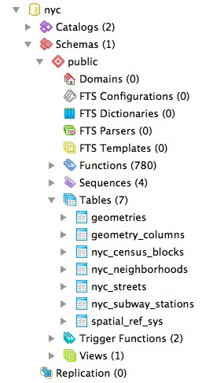

# 37. PostgreSQL 스키마 (PostgreSQL Schemas)

> 공식 원문: [<https://postgis.net/workshops/postgis-intro/schemas.html>](https://postgis.net/workshops/postgis-intro/schemas.html)\
> 공식 소스의 본문·표·SQL·이미지를 현재 페이지 순서대로 반영했습니다.

프로덕션 데이터베이스는 수백 개의 테이블, 뷰, 함수를 운용하게 되므로 이들을 모두 기본 `public` 스키마 하나에만 모아두면 관리가 매우 어려워집니다.

PostgreSQL의 **스키마(Schema)**는 파일 시스템의 폴더처럼 데이터베이스 객체들을 논리적으로 분리하여 담는 네임스페이스(Namespace)입니다.



---

## 1. 스키마 분리의 장점

1. **백업 및 복원의 유연성**: 데이터 변경 빈도가 높은 비즈니스 스키마와 정적인 기준 데이터 스키마를 분리하여 서로 다른 백업 주기를 적용할 수 있습니다.
2. **소프트웨어 및 PostGIS 버전 업그레이드 용이성**: `public` 스키마에는 시스템 확장 기능(PostGIS 함수 및 뷰)만 두고 비즈니스 데이터를 별도 스키마로 분리하면, PostGIS 업그레이드 시 데이터 손실 위험 없이 안전하게 마이그레이션할 수 있습니다.
3. **사용자별 작업 공간 격리**: 분석가마다 개인 작업용 스키마를 부여하여 임시 분석 테이블이 프로덕션 테이블과 뒤섞이는 것을 방지합니다.

---

## 2. 데이터 스키마 생성 및 테이블 이동

새 스키마 `census`를 생성하고 테이블을 이동해 보겠습니다.

```sql
-- 1. 스키마 생성
CREATE SCHEMA census;

-- 2. 기존 테이블을 새 스키마로 이동
ALTER TABLE nyc_census_blocks SET SCHEMA census;
```

### search_path 검색 경로 설정
테이블에 접근할 때 매번 `census.nyc_census_blocks`처럼 스키마명을 붙이지 않으려면 `search_path`를 설정합니다.

```sql
-- 세션 레벨 검색 경로 지정
SET search_path = census, public;

-- 특정 사용자에 대해 영구 검색 경로 지정
ALTER USER postgres SET search_path = census, public;
```

> [!IMPORTANT]
> `search_path`를 설정할 때는 항상 **`public` 스키마를 검색 경로의 마지막에 포함**해야 합니다. PostGIS의 핵심 공간 함수와 연산자들이 `public` 스키마에 상주하기 때문입니다.

---

## 3. 사용자별 개인 격리 스키마 구축 (User Workspaces)

공간 분석가는 중간 집계나 시각화를 위해 임시 테이블을 자주 생성합니다. Oracle처럼 사용자 계정과 동일한 이름의 개인 스키마를 만들어 주면 안전한 샌드박스 환경을 제공할 수 있습니다.

```sql
-- 1. 사용자 계정 생성
CREATE USER myuser WITH PASSWORD 'mypassword';
GRANT postgis_writer TO myuser;

-- 2. 사용자가 소유권을 가진 전용 스키마 생성
CREATE SCHEMA myuser AUTHORIZATION myuser;
```

PostgreSQL의 기본 `search_path` 설정은 `"$user", public`입니다. 따라서 `myuser`로 로그인하여 테이블을 생성하면 스키마 이름을 생략하더라도 자동으로 자신의 개인 스키마(`myuser.*`)에 생성되며, 프로덕션 데이터와 완벽히 격리됩니다.


---

[← 이전](36_security.md) · [목차](00_index.md) · [다음 →](38_backup.md)
