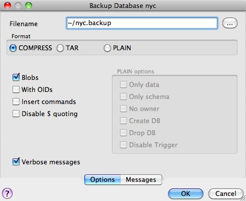
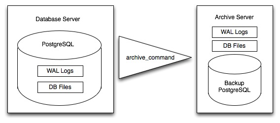

# 38. PostgreSQL 백업 및 복원 (PostgreSQL Backup and Restore)

> 공식 원문: [<https://postgis.net/workshops/postgis-intro/backup.html>](https://postgis.net/workshops/postgis-intro/backup.html)\
> 공식 소스의 본문·표·SQL·이미지를 현재 페이지 순서대로 반영했습니다.

PostgreSQL 데이터베이스의 백업 및 복구 전략은 데이터의 변경 빈도와 가용성 요구 수준에 따라 크게 두 가지 방식으로 나뉩니다.

1. **논리적 백업 (Logical Backup - `pg_dump` / `pg_restore`)**: 정기적인 데이터 스냅샷 및 스키마/테이블 단위 이관에 적합
2. **물리적 온라인 백업 및 시점 복구 (Continuous Archiving & PITR)**: 변경 사항이 빈번한 엔터프라이즈 환경에서 무중단 실시간 WAL 아카이빙 및 원하는 특정 과거 시점으로의 정밀 복구(Point-in-Time Recovery)에 적합

---

## 1. pg_dump와 pg_restore를 활용한 논리적 백업

`pg_dump`는 데이터베이스의 스키마 정의(DDL)와 데이터(DML)를 일관된 스냅샷으로 덤프하는 CLI 유틸리티입니다.



### pg_dump의 3가지 백업 포맷
- **Plain (`-F p`)**: 일반 텍스트 SQL 스크립트 파일. 텍스트 에디터로 수정할 수 있지만 복원 시 병렬 복원이 불가능합니다.
- **Custom Compressed (`-F c`, 권장)**: 고성능 압축 바이너리 포맷. 용량이 가장 작으며 `pg_restore`를 통해 특정 테이블이나 스키마만 선별 복원하거나 멀티코어 병렬 복원(`-j`)이 가능합니다.
- **Directory (`-F d`)**: 디렉터리 형태로 테이블별 파일을 분할 저장하여 대용량 병렬 백업/복원에 최적화된 포맷입니다.

### 특정 스키마만 선별 백업하기 (모범 사례)
PostGIS 시스템 함수 정의를 제외하고 순수 비즈니스 공간 데이터만 백업하려면 `--schema` 옵션을 사용합니다.

```sh
# census 스키마만 압축 포맷으로 덤프
pg_dump --format=c --schema=census --file=census.backup -d nyc -U postgres
```

### 복원 (pg_restore)

```sh
# 신규 데이터베이스 생성 및 스키마 복원
createdb -U postgres nyc2
pg_restore -d nyc2 -U postgres census.backup
```

---

## 2. 사용자 및 전역 객체 백업 (pg_dumpall --globals-only)

`pg_dump`는 개별 데이터베이스 내부 객체만 덤프합니다. 전체 데이터베이스 클러스터에서 공유하는 **사용자 계정(Roles), 그룹 권한, 테이블스페이스** 정보는 `pg_dumpall --globals-only`를 사용하여 백업합니다.

```sh
pg_dumpall --globals-only -U postgres > globals.sql
```

---

## 3. 물리적 온라인 아카이빙 및 특정 시점 복구 (PITR)

연속 아카이빙(Continuous Archiving)은 데이터베이스의 변경 사항을 담은 WAL(미리 쓰기 로그) 파일을 실시간으로 안전한 보관소에 복사하고, 주기적인 베이스 백업(Base Backup)과 결합하여 장애 직전 시점까지 무손실 복구하는 고가용성 메커니즘입니다.



### WAL 아카이빙 활성화 (`postgresql.conf`)

```text
wal_level = replica
archive_mode = on
# Linux 예시:
archive_command = 'test ! -f /mnt/backup/wal_archive/%f && cp %p /mnt/backup/wal_archive/%f'
# Windows 예시:
archive_command = 'copy "%p" "D:\\backup\\wal_archive\\%f"'
```

### 베이스 백업 수행 (`pg_basebackup`)

```sh
# 실시간 온라인 물리 백업 수행
pg_basebackup -D /mnt/backup/base_backup -Ft -z -P -U postgres
```

장애 발생 시 베이스 백업 파일 시스템을 복원한 후 아카이브된 WAL 파일들을 순차 재생(Replay)하면 원하는 특정 날짜와 시분초(`recovery_target_time`)의 상태로 완벽하게 롤포워드 복구할 수 있습니다.


---

[← 이전](37_schemas.md) · [목차](00_index.md) · [다음 →](39_upgrades.md)
