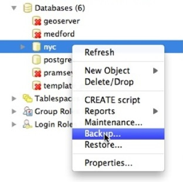
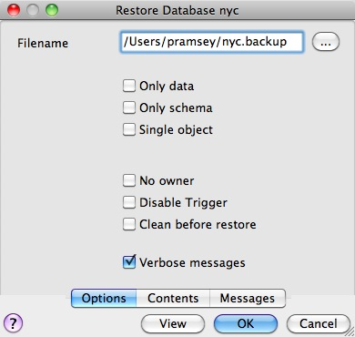
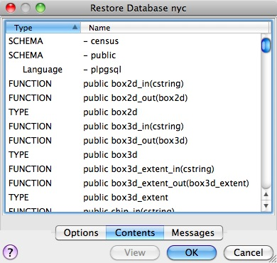

# 38. PostgreSQL 백업 및 복원 (PostgreSQL Backup and Restore)

> 공식 원문: [<https://postgis.net/workshops/postgis-intro/backup.html>](https://postgis.net/workshops/postgis-intro/backup.html)\
> 공식 소스의 본문·표·SQL·이미지를 현재 페이지 순서대로 반영했습니다.

PostgreSQL 데이터베이스를 백업하는 방법에는 여러 가지가 있으며, 선택하는 방법은 데이터베이스 사용 방법에 따라 크게 달라집니다.

- 비교적 정적인 데이터베이스의 경우 기본 pg_dump/pg_restore 도구를 사용하여 데이터의 주기적 스냅샷을 찍을 수 있습니다.
- 자주 변경되는 데이터의 경우 "온라인 백업" 구성표를 사용하면 업데이트를 안전한 위치에 지속적으로 보관할 수 있습니다.

온라인 백업은 특히 PostgreSQL \>= 9.0 버전의 경우 [고가용성](http://www.postgresql.org/docs/current/static/high-availability.html)을 위한 복제 및 대기 시스템의 기초입니다.

## 데이터 레이아웃

`schemas`에서 설명한 것처럼 프로덕션 데이터가 항상 별도의 스키마에 저장되도록 하는 것은 데이터 관리에 있어 매우 중요한 **모범 사례**입니다. 두 가지 이유가 있습니다:

- 개별적으로 백업할 테이블 목록을 관리하는 것보다 스키마에 있는 데이터를 백업하고 복원하는 것이 훨씬 간단합니다.
- `upgrades`에 설명된 대로 데이터 테이블을 "공용" 스키마에서 제외하면 업그레이드가 훨씬 쉬워집니다.

## 기본 백업 및 복원

[pg_dump](http://www.postgresql.org/docs/current/static/app-pgdump.html) 유틸리티를 사용하면 전체 데이터베이스를 쉽게 백업할 수 있습니다. 이 유틸리티는 명령줄 도구로, 스크립팅을 통해 쉽게 자동화할 수 있으며 PgAdmin 유틸리티의 GUI를 통해 호출할 수도 있습니다.

`nyc` 데이터베이스를 백업하려면 GUI를 사용하고 백업하려는 데이터베이스를 마우스 오른쪽 버튼으로 클릭하면 됩니다.



생성하려는 백업 파일의 이름을 입력하세요.


압축, tar 및 일반의 세 가지 백업 형식 옵션이 있습니다.

- **Plain**는 단지 텍스트 SQL 파일입니다. 이는 가장 간단한 형식이고 여러 면에서 가장 유연합니다. 쉽게 편집하거나 변경할 수 있고 데이터베이스에 다시 로드할 수 있어 소유권이나 기타 글로벌 정보와 같은 항목을 오프라인으로 변경할 수 있기 때문입니다.
- **Tar**는 UNIX 아카이브 형식을 사용하여 덤프 구성 요소를 별도의 파일에 보관합니다. tar 형식을 사용하면 [pg_restore](http://www.postgresql.org/docs/current/static/app-pgrestore.html) 유틸리티가 덤프의 일부를 선택적으로 복원할 수 있습니다.
- **Compress**는 Tar 형식과 유사하지만 내부 구성 요소를 개별적으로 압축하므로 전체 아카이브의 압축을 풀지 않고도 선택적으로 복원할 수 있습니다.

압축 옵션을 확인하고 백업 파일을 저장해 보겠습니다.

다음과 같이 명령줄을 사용하여 동일한 작업을 수행할 수 있습니다.

    pg_dump --file=nyc.backup --format=c --port=54321 --username=postgres nyc

백업 파일은 압축 형식이므로 [pg_restore](http://www.postgresql.org/docs/current/static/app-pgrestore.html) 명령을 사용하여 매니페스트를 나열하여 내용을 볼 수 있습니다. PgAdmin GUI에서 "보기"는 패널의 옵션입니다.



매니페스트를 보면 눈에 띄는 것 중 하나는 거기에 "FUNCTION" 서명이 많이 있다는 것입니다.



이는 [pg_dump](http://www.postgresql.org/docs/current/static/app-pgdump.html) 유틸리티가 **every** 비시스템 개체를 데이터베이스에 덤프하고 여기에 PostGIS 함수 정의가 포함되어 있기 때문입니다.

> [!NOTE]
> PostgreSQL 9.1+에는 PostGIS와 같은 추가 기능 패키지를 등록된 시스템 구성 요소로 설치하여 [pg_dump](http://www.postgresql.org/docs/current/static/app-pgdump.html) 출력에서 제외할 수 있는 "EXTENSION" 기능이 포함되어 있습니다. PostGIS 2.0 이상에서는 이 확장 시스템을 사용한 설치를 지원합니다.

[pg_restore](http://www.postgresql.org/docs/current/static/app-pgrestore.html)를 직접 사용하여 명령줄에서 동일한 매니페스트를 볼 수 있습니다.

    pg_restore --list nyc.backup

PostGIS 함수 서명으로 가득 찬 덤프 파일의 문제점은 우리가 실제로 시스템 함수가 아닌 데이터 덤프를 원했다는 것입니다.

모든 개체가 덤프 파일에 있으므로 빈 데이터베이스로 복원하고 전체 기능을 얻을 수 있습니다. 그렇게 함으로써 우리는 복원하려는 시스템이 우리가 덤프한 시스템과 정확히 동일한 버전의 PostGIS를 가질 것으로 예상합니다(함수 서명 정의가 PostGIS 공유 라이브러리의 특정 버전을 참조하기 때문에).

명령줄에서 복원은 다음과 같습니다.

    createdb --port 54321 nyc2
    pg_restore --dbname=nyc2 --port 54321 --username=postgres nyc.backup

함수 서명 없이 데이터만 덤프하는 것은 특정 스키마만 덤프하는 명령줄 플래그가 있기 때문에 스키마에 데이터를 갖는 것이 편리한 곳입니다.

    pg_dump --port=54321 -format=c --schema=census --file=census.backup

이제 덤프 내용을 나열하면 원하는 데이터 테이블만 표시됩니다.

    pg_restore --list census.backup

    ;
    ; Archive created at Thu Aug  9 11:02:49 2012
    ;     dbname: nyc
    ;     TOC Entries: 11
    ;     Compression: -1
    ;     Dump Version: 1.11-0
    ;     Format: CUSTOM
    ;     Integer: 4 bytes
    ;     Offset: 8 bytes
    ;     Dumped from database version: 8.4.9
    ;     Dumped by pg_dump version: 8.4.9
    ;
    ;
    ; Selected TOC Entries:
    ;
    6; 2615 20091 SCHEMA - census postgres
    146; 1259 19845 TABLE census nyc_census_blocks postgres
    145; 1259 19843 SEQUENCE census nyc_census_blocks_gid_seq postgres
    2691; 0 0 SEQUENCE OWNED BY census nyc_census_blocks_gid_seq postgres
    2692; 0 0 SEQUENCE SET census nyc_census_blocks_gid_seq postgres
    2681; 2604 19848 DEFAULT census gid postgres
    2688; 0 19845 TABLE DATA census nyc_census_blocks postgres
    2686; 2606 19853 CONSTRAINT census nyc_census_blocks_pkey postgres
    2687; 1259 20078 INDEX census nyc_census_blocks_geom_gist postgres

데이터 테이블만 있으면 편리합니다. `upgrades`에서 설명한 것처럼 모든 버전의 PostGIS가 설치된 데이터베이스에 저장할 수 있기 때문입니다.

### 사용자 백업

[pg_dump](http://www.postgresql.org/docs/current/static/app-pgdump.html) 유틸리티는 한 번에 데이터베이스(또는 제한하는 경우 한 번에 스키마나 테이블)를 작동합니다. 그러나 사용자에 대한 정보는 전체 클러스터에 저장되며 어느 하나의 데이터베이스에도 저장되지 않습니다!

사용자 정보를 백업하려면 "--globals-only" 플래그와 함께 [pg_dumpall](http://www.postgresql.org/docs/current/static/app-pg-dumpall.html) 유틸리티를 사용하세요.

    pg_dumpall --globals-only --port 54321

기본 모드에서 [pg_dumpall](http://www.postgresql.org/docs/current/static/app-pg-dumpall.html)을 사용하여 전체 클러스터를 백업할 수도 있지만, [pg_dump](http://www.postgresql.org/docs/current/static/app-pgdump.html)와 마찬가지로 결국 PostGIS 기능 서명을 백업하게 되므로 동일한 소프트웨어 설치에 대해 덤프를 복원해야 하며 업그레이드 프로세스의 일부로 사용할 수 없습니다.

## 온라인 백업 및 복원

온라인 백업 및 복원을 통해 관리자는 전체 데이터베이스를 반복적으로 덤프하는 오버헤드 없이 매우 최신 백업 파일 세트를 유지할 수 있습니다. 데이터베이스가 자주 삽입 및 업데이트 로드되는 경우에는 기본 백업보다 온라인 백업이 더 나을 수 있습니다.

> [!NOTE]
> 온라인 백업에 대해 배우는 가장 좋은 방법은 [지속적 보관 및 특정 시점 복구](http://www.postgresql.org/docs/current/static/continuous-archiving.html)에 대한 PostgreSQL 매뉴얼의 관련 섹션을 읽는 것입니다. PostGIS 워크숍의 이 섹션에서는 온라인 백업 설정에 대한 간략한 스냅샷을 제공합니다.

### 작동 방식

PostgreSQL은 기본 데이터 테이블에 계속해서 쓰는 대신 처음에 변경 사항을 "WAL(미리 쓰기 로그)"에 저장합니다. 종합하면 이러한 로그는 데이터베이스에 대한 모든 변경 사항에 대한 완전한 기록입니다. 온라인 백업은 데이터베이스 기본 데이터 테이블의 복사본을 가져온 다음 그 이후 생성되는 각 WAL의 복사본을 가져오는 것으로 구성됩니다.


새 데이터베이스로 복구할 때가 되면 시스템은 기본 데이터 복사본에서 시작한 다음 모든 WAL 파일을 데이터베이스에 재생합니다. 최종 결과는 마지막 WAL 수신 시점의 원본과 동일한 상태로 복원된 데이터베이스입니다.

WAL은 어쨌든 작성되고 사본을 아카이브 서버로 전송하는 것은 계산 비용이 저렴하기 때문에 온라인 백업은 집중적인 정기 전체 덤프에 의존하지 않고도 시스템의 최신 백업을 유지하는 효과적인 수단입니다.

### WAL 파일 보관

온라인 백업을 설정할 때 가장 먼저 해야 할 일은 보관 방법을 만드는 것입니다. PostgreSQL 보관 방법은 최고의 유연성을 제공합니다. PostgreSQL 백엔드는 `archive_command` 구성 매개변수에 지정된 스크립트를 호출하기만 하면 됩니다.

이는 파일을 네트워크에 장착된 드라이브에 복사하는 것만큼 간단할 수도 있고, 파일을 암호화하여 원격 아카이브에 이메일로 보내는 것만큼 복잡할 수도 있다는 의미입니다. 스크립트를 작성할 수 있는 모든 프로세스는 파일을 보관하는 데 사용할 수 있습니다.

보관을 켜려면 `postgresql.conf`를 편집하고 먼저 WAL 보관을 켭니다.

    wal_level = archive
    archive_mode = on

그런 다음 아카이브 파일을 안전한 위치에 복사하도록 `archive_command`를 설정합니다(대상 경로를 적절하게 변경).

    # Unix
    archive_command = 'test ! -f /archivedir/%f && cp %p /archivedir/%f'

    # Windows
    archive_command = 'copy "%p" "C:\\archivedir\\%f"'

archive 명령이 기존 파일을 덮어쓰지 않는 것이 중요하므로 unix 명령에는 파일이 이미 존재하지 않는지 확인하는 초기 테스트가 포함됩니다. 복사 프로세스가 실패할 경우 명령이 0이 아닌 상태를 반환하는 것도 중요합니다.

변경이 완료되면 PostgreSQL을 다시 시작하여 적용할 수 있습니다.

### 기본 백업 수행

보관 프로세스가 완료되면 기본 백업을 수행해야 합니다.

데이터베이스를 백업 모드로 전환합니다. 이는 쿼리 작업이나 데이터 업데이트를 변경하는 데 아무 작업도 수행하지 않으며 단지 체크포인트를 강제 실행하고 백업이 수행된 시기를 나타내는 레이블 파일을 작성합니다.

```sql
SELECT pg_start_backup('/archivedir/basebackup.tgz');
```

레이블의 경우 백업 파일의 경로를 사용하는 것이 좋습니다. 백업이 저장된 위치를 추적하는 데 도움이 되기 때문입니다.

데이터베이스를 보관 위치에 복사합니다.

    # Unix
    tar cvfz /archivedir/basebackup.tgz ${PGDATA}

그런 다음 데이터베이스에 백업 프로세스가 완료되었음을 알립니다.

```sql
SELECT pg_stop_backup();
```

물론 이러한 모든 단계는 정기적인 기본 백업을 위해 스크립트로 작성될 수 있습니다.

### 아카이브에서 복원

이러한 단계는 [지속적 보관 및 특정 시점 복구](http://www.postgresql.org/docs/current/static/continuous-archiving.html)에 대한 PostgreSQL 매뉴얼에서 수행됩니다.

- 서버가 실행 중이면 중지합니다.
- 공간이 있는 경우 나중에 필요할 경우를 대비하여 전체 클러스터 데이터 디렉터리와 테이블스페이스를 임시 위치에 복사합니다. 이 예방 조치를 수행하려면 시스템에 기존 데이터베이스의 복사본 두 개를 보관할 수 있는 충분한 여유 공간이 있어야 합니다. 공간이 충분하지 않은 경우 최소한 클러스터의 pg_xlog 하위 디렉터리의 내용을 저장해야 합니다. 시스템이 다운되기 전에 보관되지 않은 로그가 포함될 수 있기 때문입니다.
- 클러스터 데이터 디렉터리와 사용 중인 테이블스페이스의 루트 디렉터리 아래에 있는 기존 파일과 하위 디렉터리를 모두 제거합니다.
- 파일 시스템 백업에서 데이터베이스 파일을 복원합니다. 올바른 소유권(루트가 아닌 데이터베이스 시스템 사용자)과 올바른 권한으로 복원되었는지 확인하십시오. 테이블스페이스를 사용하는 경우 pg_tblspc/의 심볼릭 링크가 올바르게 복원되었는지 확인해야 합니다.
- pg_xlog/에 있는 모든 파일을 제거합니다. 이는 파일 시스템 백업에서 나온 것이므로 최신이 아니라 더 이상 사용되지 않을 수 있습니다. pg_xlog/를 전혀 아카이브하지 않은 경우 적절한 권한으로 다시 생성하고 이전에 그런 식으로 설정한 경우 심볼릭 링크로 다시 설정했는지 확인하십시오.
- 2단계에서 저장한 보관 해제된 WAL 세그먼트 파일이 있는 경우 이를 pg_xlog/에 복사합니다. (이동하지 말고 복사하는 것이 가장 좋습니다. 따라서 문제가 발생하여 다시 시작해야 하는 경우에도 수정되지 않은 파일이 그대로 남아 있습니다.)
- 클러스터 데이터 디렉토리에 복구 명령 파일인 Recovery.conf를 생성합니다(26장 참조). 또한 복구가 성공했다고 확신할 때까지 일반 사용자가 연결하지 못하도록 pg_hba.conf를 임시로 수정할 수도 있습니다.
- 서버를 시작하세요. 서버는 복구 모드로 전환되어 필요한 보관된 WAL 파일을 계속해서 읽습니다. 외부 오류로 인해 복구가 종료된 경우 서버를 다시 시작하면 복구가 계속됩니다. 복구 프로세스가 완료되면 서버는 Recovery.conf의 이름을 Recovery.done으로 변경하고(나중에 실수로 복구 모드로 다시 들어가는 것을 방지하기 위해) 일반 데이터베이스 작업을 시작합니다.
- 데이터베이스의 내용을 검사하여 원하는 상태로 복구되었는지 확인합니다. 그렇지 않은 경우 1단계로 돌아가십시오. 모든 것이 정상이면 pg_hba.conf를 정상으로 복원하여 사용자가 연결할 수 있도록 허용하십시오.

## 링크

- [pg_dump](http://www.postgresql.org/docs/current/static/app-pgdump.html)
- [pg_dumpall](http://www.postgresql.org/docs/current/static/app-pg-dumpall.html)
- [pg_restore](http://www.postgresql.org/docs/current/static/app-pgrestore.html)
- [PostgreSQL 고가용성](http://www.postgresql.org/docs/current/static/high-availability.html)
- [PostgreSQL 고가용성 연속 아카이빙 및 PITR](http://www.postgresql.org/docs/current/static/continuous-archiving.html)

------------------------------------------------------------------------

<details markdown="1">
<summary><strong>기존 로컬 문서 보존본</strong> — 로컬 실습 확장·요약 내용</summary>

# 38. PostgreSQL 백업 및 복원 (PostgreSQL Backup and Restore)

대용량 공간 데이터베이스의 데이터 손실을 방지하기 위한 정기적인 백업 및 복구 절차입니다.

---

## 1. pg_dump를 사용한 백업

`pg_dump`는 PostgreSQL의 표준 데이터베이스 백업 유틸리티입니다.

### 커스텀 압축 포맷 백업 (권장):
```bash
pg_dump -U postgres -Fc -b -v -f nyc_backup.dump nyc
```
- `-Fc`: pg_restore로 유연하게 복원 가능한 고성능 압축 바이너리 포맷
- `-b`: 대용량 Large Object 포함
- `-v`: 상세 진행 상황 출력(Verbose)

### 특정 공간 테이블만 백업:
```bash
pg_dump -U postgres -Fc -t nyc_streets -f nyc_streets.dump nyc
```

---

## 2. pg_restore를 사용한 복원

```bash
# 새 데이터베이스 생성 후 덤프 파일 복원
createdb -U postgres nyc_restore
pg_restore -U postgres -d nyc_restore -v nyc_backup.dump
```

멀티코어 병렬 복원(`-j` 옵션)을 사용하면 대용량 공간 인덱스 재생성 시간을 대폭 단축할 수 있습니다:
```bash
pg_restore -U postgres -d nyc_restore -j 4 nyc_backup.dump
```

---

| [⬅️ 37. PostgreSQL 스키마 (PostgreSQL Schemas)](37_schemas.md) | [🏠 워크숍 목차](README.md) | [39. 소프트웨어 업그레이드 (Software Upgrades) ➡️](39_upgrades.md) |
| :--- | :---: | ---: |

</details>

---

[← 이전](37_schemas.md) · [목차](00_index.md) · [다음 →](39_upgrades.md)