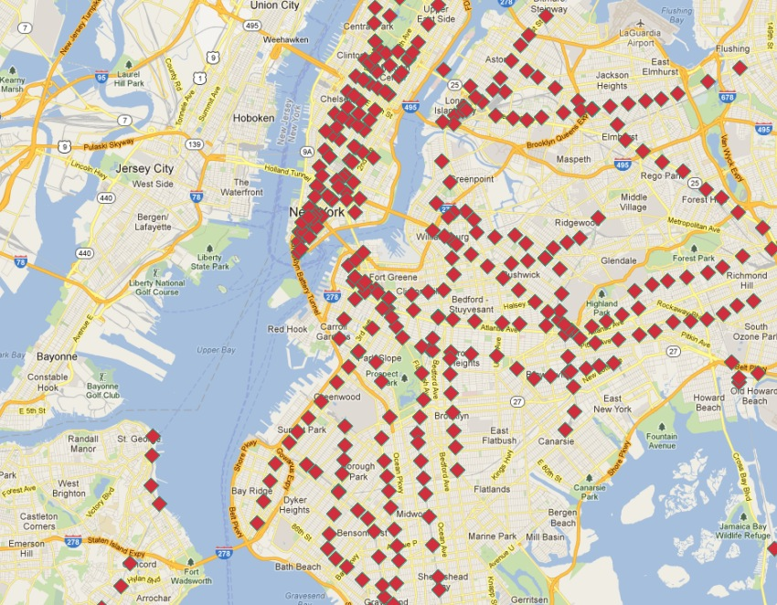
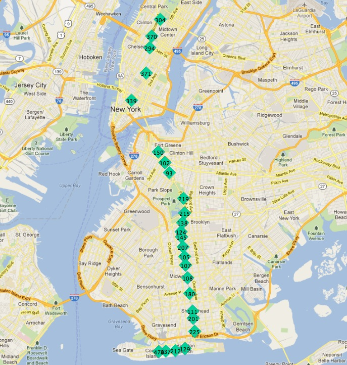
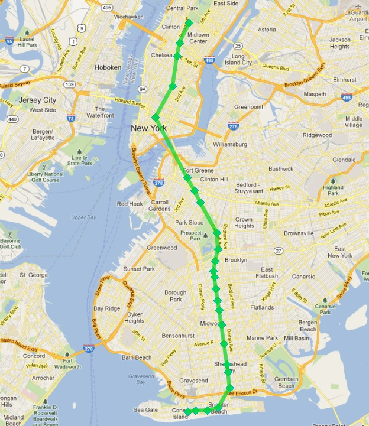
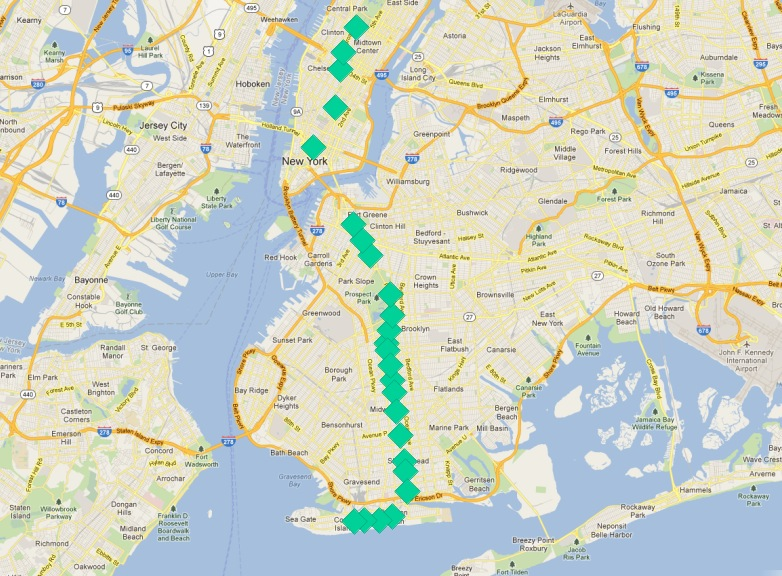
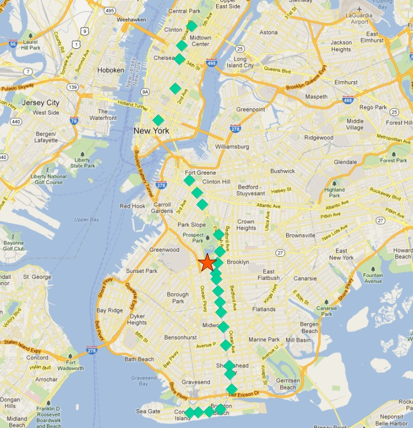
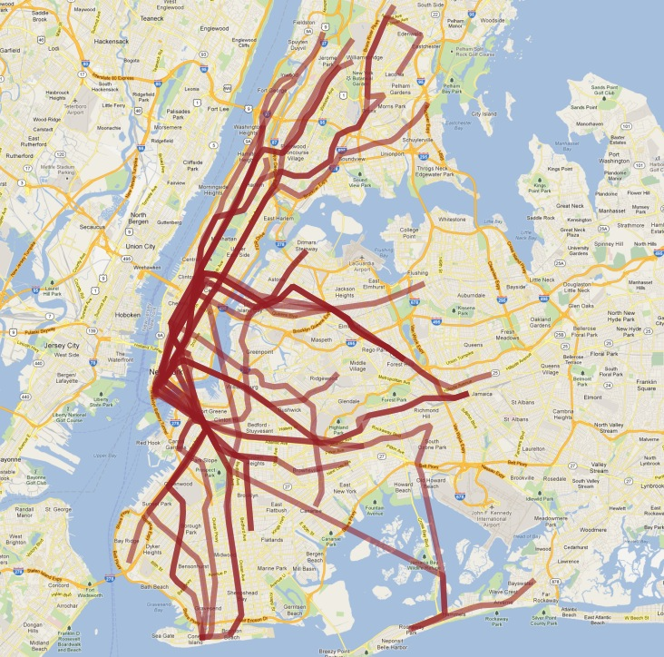

# 40. 고급 지오메트리 생성 (Advanced Geometry Constructions)

> 공식 원문: [<https://postgis.net/workshops/postgis-intro/advanced_geometry_construction.html>](https://postgis.net/workshops/postgis-intro/advanced_geometry_construction.html)\
> 공식 소스의 본문·표·SQL·이미지를 현재 페이지 순서대로 반영했습니다.

`nyc_subway_stations` 레이어는 지금까지 많은 흥미로운 예제를 제공했지만 여기에는 놀라운 점이 있습니다.



모든 역의 데이터베이스이지만 경로를 쉽게 시각화할 수는 없습니다! 이 장에서는 PostgreSQL과 PostGIS의 고급 기능을 사용하여 지하철 역의 포인트 레이어에서 새로운 선형 경로 레이어를 구축할 것입니다.

우리의 임무는 다음 두 가지 문제로 인해 특히 어려워졌습니다.

- `nyc_subway_stations`의 `routes` 열에는 각 행에 여러 경로 식별자가 있으므로 여러 경로에 나타날 수 있는 역은 테이블에 한 번만 나타납니다.
- 이전 문제와 관련하여 역 테이블에는 경로 순서 정보가 없으므로 특정 경로의 모든 역을 찾는 것은 가능하지만 속성을 사용하여 열차가 역을 통과하는 순서를 결정하는 것은 불가능합니다.

두 번째 문제는 더 어려운 문제입니다. 경로에 순서가 지정되지 않은 지점 집합이 있는 경우 실제 경로와 일치하도록 정렬하는 방법은 무엇입니까?

'Q' 열차의 정류장은 다음과 같습니다.

```sql
SELECT s.gid, s.geom
FROM nyc_subway_stations s
WHERE (strpos(s.routes, 'Q') <> 0);
```

이 그림에서 정류장은 고유한 `gid` 기본 키로 레이블이 지정되어 있습니다.



종착역 중 하나에서 출발하면 노선의 다음 역이 항상 가장 가까운 것처럼 보입니다. 검색에서 이전에 찾은 모든 방송국을 제외하는 한 매번 프로세스를 반복할 수 있습니다.

데이터베이스에서 이러한 반복 루틴을 실행하는 방법에는 두 가지가 있습니다.

- [PL/PgSQL](http://www.postgresql.org/docs/current/static/plpgsql.html)과 같은 절차적 언어를 사용합니다.
- 재귀적 [공통 테이블 표현식](http://www.postgresql.org/docs/current/static/queries-with.html)을 사용합니다.

공통 테이블 표현식(CTE)은 실행하는 데 함수 정의가 필요하지 않다는 장점이 있습니다. 다음은 최북단 정류장(`gid`가 304)에서 시작하여 'Q' 열차의 노선 노선을 계산하는 CTE입니다.

```sql
WITH RECURSIVE next_stop(geom, idlist) AS (
    (SELECT
      geom,
      ARRAY[gid] AS idlist
    FROM nyc_subway_stations
    WHERE gid = 304)
    UNION ALL
    (SELECT
      s.geom,
      array_append(n.idlist, s.gid) AS idlist
    FROM nyc_subway_stations s, next_stop n
    WHERE strpos(s.routes, 'Q') != 0
    AND NOT n.idlist @> ARRAY[s.gid]
    ORDER BY ST_Distance(n.geom, s.geom) ASC
    LIMIT 1)
)
SELECT geom, idlist FROM next_stop;
```

CTE는 함께 결합된 두 부분으로 구성됩니다.

- 전반부는 표현의 시작점을 설정합니다. 우리는 "gid" 304(줄의 끝) 레코드를 사용하여 초기 기하학을 얻고 방문한 식별자의 배열을 초기화합니다.
- 후반부는 더 이상 레코드를 찾을 수 없을 때까지 반복됩니다. 각 반복마다 "next_stop"에 대한 자체 참조를 통해 이전 반복의 값을 가져옵니다. 우리는 방문 목록(**NOT n.idlist @\> ARRAY\[s.gid\]**)에 아직 추가하지 않은 Q 라인(**strpos(s.routes,'Q')**)의 모든 정류장을 검색하고 첫 번째 지점(가장 가까운)만 선택하여 이전 지점으로부터의 거리를 기준으로 정렬합니다.

재귀적 CTE 자체 외에도 여기에는 다양한 고급 PostgreSQL 배열 기능이 사용됩니다.

- 우리는 ARRAY를 사용하고 있습니다! PostgreSQL은 모든 유형의 배열을 지원합니다. 이 경우 정수 배열이 있지만 도형 배열이나 다른 PostgreSQL 유형을 구축할 수도 있습니다.
- **array_append**를 사용하여 방문한 식별자 배열을 구축하고 있습니다.
- 우리는 이미 방문한 Q 기차역을 찾기 위해 **@\>** 배열 연산자("배열 포함")를 사용하고 있습니다. **@\>** 연산자에는 양쪽에 ARRAY 값이 필요하므로 ARRAY\[\] 구문을 사용하여 개별 "gid" 숫자를 단일 항목 배열로 변환해야 합니다.

쿼리를 실행하면 각 도형을 찾은 순서(경로 순서)와 이미 방문한 식별자 목록을 얻을 수 있습니다. 도형을 PostGIS [ST_MakeLine](http://postgis.net/docs/ST_MakeLine.html) 집계 함수로 래핑하면 도형 세트가 제공된 순서대로 구성된 단일 선형 출력으로 변환됩니다.

```sql
WITH RECURSIVE next_stop(geom, idlist) AS (
    (SELECT
      geom,
      ARRAY[gid] AS idlist
    FROM nyc_subway_stations
    WHERE gid = 304)
    UNION ALL
    (SELECT
      s.geom,
      array_append(n.idlist, s.gid) AS idlist
    FROM nyc_subway_stations s, next_stop n
    WHERE strpos(s.routes, 'Q') != 0
    AND NOT n.idlist @> ARRAY[s.gid]
    ORDER BY ST_Distance(n.geom, s.geom) ASC
    LIMIT 1)
)
SELECT ST_MakeLine(geom) AS geom FROM next_stop;
```

다음과 같습니다.



*성공!*

단, 두 가지 문제는 다음과 같습니다.

- 여기서는 하나의 지하철 노선만 계산하고 있으며 모든 노선을 계산하려고 합니다.
- 우리의 쿼리에는 경로를 구축하는 검색 알고리즘의 시드 역할을 하는 초기 정거장 식별자인 *선험적* 지식이 포함되어 있습니다.

경로를 구성하는 일련의 역을 수동으로 살펴보지 않고 경로의 첫 번째 역을 알아내는 어려운 문제를 먼저 해결해 보겠습니다.

우리의 'Q' 열차 정류장은 출발점 역할을 할 수 있습니다. 경로의 종착역의 특징은 무엇입니까?



한 가지 대답은 "그들은 가장 북쪽과 남쪽의 역입니다"입니다. 하지만 'Q' 열차가 동쪽에서 서쪽으로 운행한다고 상상해 보세요. 조건이 계속 유지되나요?

종착역에 대한 덜 방향적인 특성은 "경로 중간에서 가장 먼 역입니다"입니다. 이 특성화를 사용하면 경로가 북쪽/남쪽 또는 동쪽/서쪽을 향하는지 여부는 중요하지 않으며 단지 거의 한 방향, 특히 끝 부분으로 향한다는 점만 다릅니다.

끝점을 알아내는 100% 경험적 방법은 없으므로 이 두 번째 규칙을 시도해 보겠습니다.

> [!NOTE]
> "중간에서 가장 먼" 규칙의 명백한 실패 모드는 영국 런던의 Circle Line과 같은 원형 선입니다. 다행히 뉴욕에는 그런 노선이 없습니다!

모든 경로의 종착역을 계산하려면 먼저 어떤 경로가 있는지 알아내야 합니다! 우리는 뚜렷한 경로를 찾습니다.

```sql
WITH routes AS (
  SELECT DISTINCT unnest(string_to_array(routes,',')) AS route
  FROM nyc_subway_stations ORDER BY route
)
SELECT * FROM routes;
```

두 가지 고급 PostgreSQL ARRAY 함수 사용에 유의하세요.

- **string_to_array**는 문자열을 가져와 구분 문자를 사용하여 배열로 분할합니다. [PostgreSQL은 모든 유형의 배열을 지원](http://www.postgresql.org/docs/current/static/arrays.html)하므로 이 경우와 같이 문자열 배열을 구축할 수 있을 뿐만 아니라 이 예제의 뒷부분에서 볼 수 있는 도형 및 지리 배열도 구축할 수 있습니다.
- **unnest**는 배열을 가져와서 배열의 각 항목에 대해 새 행을 만듭니다. 그 효과는 단일 행에 포함된 "수평" 배열을 각 값에 대한 행이 있는 "수직" 배열로 바꾸는 것입니다.

결과는 모든 고유한 지하철 노선 식별자 목록입니다.

    route
    -------
    1
    2
    3
    4
    5
    6
    7
    A
    B
    C
    D
    E
    F
    G
    J
    L
    M
    N
    Q
    R
    S
    V
    W
    Z
    (24 rows)

이 결과를 `nyc_subway_stations` 테이블에 다시 결합하여 각 경로에 대해 해당 경로의 모든 스테이션에 대한 행이 있는 새 테이블을 생성함으로써 이 결과를 구축할 수 있습니다.

```sql
WITH routes AS (
  SELECT DISTINCT unnest(string_to_array(routes,',')) AS route
  FROM nyc_subway_stations ORDER BY route
),
stops AS (
  SELECT s.gid, s.geom, r.route
  FROM routes r
  JOIN nyc_subway_stations s
  ON (strpos(s.routes, r.route) <> 0)
)
SELECT * FROM stops;
```

    gid |                      geom                      | route
    -----+----------------------------------------------------+-------
      2 | 010100002026690000CBE327F938CD21415EDBE1572D315141 | 1
      3 | 010100002026690000C676635D10CD2141A0ECDB6975305141 | 1
     20 | 010100002026690000AE59A3F82C132241D835BA14D1435141 | 1
     22 | 0101000020266900003495A303D615224116DA56527D445141 | 1
                               ...etc...

이제 각 경로의 모든 스테이션을 하나의 다중 지점으로 수집하고 해당 다중 지점의 중심을 계산하여 중심점을 찾을 수 있습니다.

```sql
WITH routes AS (
  SELECT DISTINCT unnest(string_to_array(routes,',')) AS route
  FROM nyc_subway_stations ORDER BY route
),
stops AS (
  SELECT s.gid, s.geom, r.route
  FROM routes r
  JOIN nyc_subway_stations s
  ON (strpos(s.routes, r.route) <> 0)
),
centers AS (
  SELECT ST_Centroid(ST_Collect(geom)) AS geom, route
  FROM stops
  GROUP BY route
)
SELECT * FROM centers;
```

'Q' 열차 정류장 모음의 중심점은 다음과 같습니다.



따라서 가장 북쪽에 있는 정류장인 종점은 중앙에서 가장 먼 정류장이기도 한 것으로 보입니다. 모든 경로에 대해 가장 먼 지점을 계산해 봅시다.

```sql
WITH routes AS (
  SELECT DISTINCT unnest(string_to_array(routes,',')) AS route
  FROM nyc_subway_stations ORDER BY route
),
stops AS (
  SELECT s.gid, s.geom, r.route
  FROM routes r
  JOIN nyc_subway_stations s
  ON (strpos(s.routes, r.route) <> 0)
),
centers AS (
  SELECT ST_Centroid(ST_Collect(geom)) AS geom, route
  FROM stops
  GROUP BY route
),
stops_distance AS (
  SELECT s.*, ST_Distance(s.geom, c.geom) AS distance
  FROM stops s JOIN centers c
  ON (s.route = c.route)
  ORDER BY route, distance DESC
),
first_stops AS (
  SELECT DISTINCT ON (route) stops_distance.*
  FROM stops_distance
)
SELECT * FROM first_stops;
```

이번에는 두 개의 하위 쿼리를 추가했습니다.

- **stops_distance**는 중심점을 역 테이블에 다시 결합하고 각 경로의 역과 중심 사이의 거리를 계산합니다. 결과는 각 경로별로 일괄적으로 기록이 나오도록 정렬되며, 가장 먼 역이 일괄의 첫 번째 기록이 됩니다.
- **first_stops**는 **stops_distance**의 각 그룹에서 첫 번째 레코드만 선택합니다. **stops_distance**를 거리 내림차순으로 정렬했으므로 첫 번째 레코드가 가장 먼 역입니다. 이 역을 각 지하철 노선을 만들기 시작할 기준점으로 사용합니다.

이제 우리는 모든 경로를 알고 있으며 각 경로가 어느 역에서 시작하는지 (대략) 알고 있습니다. 이제 경로 노선을 생성할 준비가 되었습니다!

하지만 먼저 재귀 CTE 표현식을 매개변수를 사용하여 호출할 수 있는 함수로 바꿔야 합니다.

```plpgsql
CREATE OR REPLACE function walk_subway(integer, text) returns geometry AS
$$
WITH RECURSIVE next_stop(geom, idlist) AS (
    (SELECT
      geom AS geom,
      ARRAY[gid] AS idlist
    FROM nyc_subway_stations
    WHERE gid = $1)
    UNION ALL
    (SELECT
      s.geom AS geom,
      array_append(n.idlist, s.gid) AS idlist
    FROM nyc_subway_stations s, next_stop n
    WHERE strpos(s.routes, $2) != 0
    AND NOT n.idlist @> ARRAY[s.gid]
    ORDER BY ST_Distance(n.geom, s.geom) ASC
    LIMIT 1)
)
SELECT ST_MakeLine(geom) AS geom
FROM next_stop;
$$
language 'sql';
```

이제 우리는 갈 준비가 되었습니다!

```sql
CREATE TABLE nyc_subway_lines AS
-- Distinct route identifiers!
WITH routes AS (
  SELECT DISTINCT unnest(string_to_array(routes,',')) AS route
  FROM nyc_subway_stations ORDER BY route
),
-- Joined back to stops! Every route has all its stops!
stops AS (
  SELECT s.gid, s.geom, r.route
  FROM routes r
  JOIN nyc_subway_stations s
  ON (strpos(s.routes, r.route) <> 0)
),
-- Collects stops by routes and calculate centroid!
centers AS (
  SELECT ST_Centroid(ST_Collect(geom)) AS geom, route
  FROM stops
  GROUP BY route
),
-- Calculate stop/center distance for each stop in each route.
stops_distance AS (
  SELECT s.*, ST_Distance(s.geom, c.geom) AS distance
  FROM stops s JOIN centers c
  ON (s.route = c.route)
  ORDER BY route, distance DESC
),
-- Filter out just the furthest stop/center pairs.
first_stops AS (
  SELECT DISTINCT ON (route) stops_distance.*
  FROM stops_distance
)
-- Pass the route/stop information into the linear route generation function!
SELECT
  ascii(route) AS gid, -- QGIS likes numeric primary keys
  route,
  walk_subway(gid, route) AS geom
FROM first_stops;

-- Do some housekeeping too
ALTER TABLE nyc_subway_lines ADD PRIMARY KEY (gid);
```

QGIS에서 시각화한 최종 테이블은 다음과 같습니다:



늘 그렇듯이, 데이터를 단순하게 이해하는 데에는 몇 가지 문제가 있습니다.

- 실제로 두 개의 'S'(단거리 "셔틀") 열차가 있는데, 하나는 맨해튼에, 다른 하나는 Rockaways에 있으며 둘 다 'S'라고 불리기 때문에 함께 연결합니다.
- '4' 열차(및 기타 몇 개)는 한 줄의 끝에서 두 개의 종점으로 분할되므로 "한 줄을 따른다"는 가정이 깨지고 결과는 끝에 재미있는 고리가 있습니다.

이 예제를 통해 PostgreSQL과 PostGIS의 고급 기능을 결합하여 가능한 복잡한 데이터 조작의 일부를 맛보실 수 있었기를 바랍니다.

## 참고 항목

- [PostgreSQL 배열](http://www.postgresql.org/docs/current/static/arrays.html)
- [PostgreSQL 배열 함수](http://www.postgresql.org/docs/current/static/functions-array.html)
- [PostgreSQL 재귀 공통 TABLE 표현식](http://www.postgresql.org/docs/current/static/queries-with.html)
- [PostGIS ST_MakeLine](http://postgis.net/docs/ST_MakeLine.html)


---

[← 이전](39_upgrades.md) · [목차](00_index.md) · [다음 →](41_postgis_functions.md)
